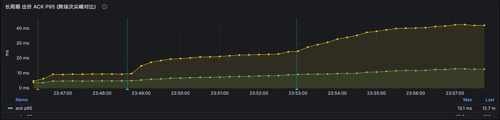
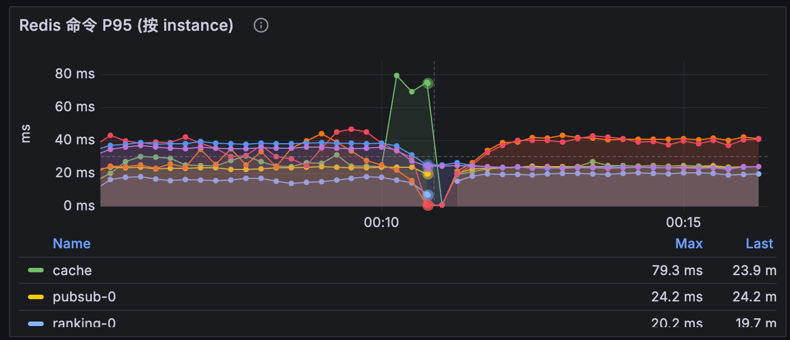
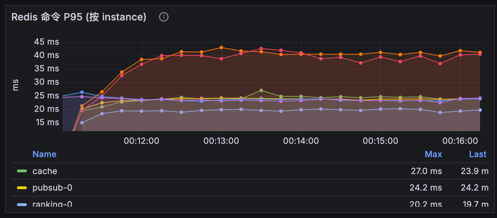
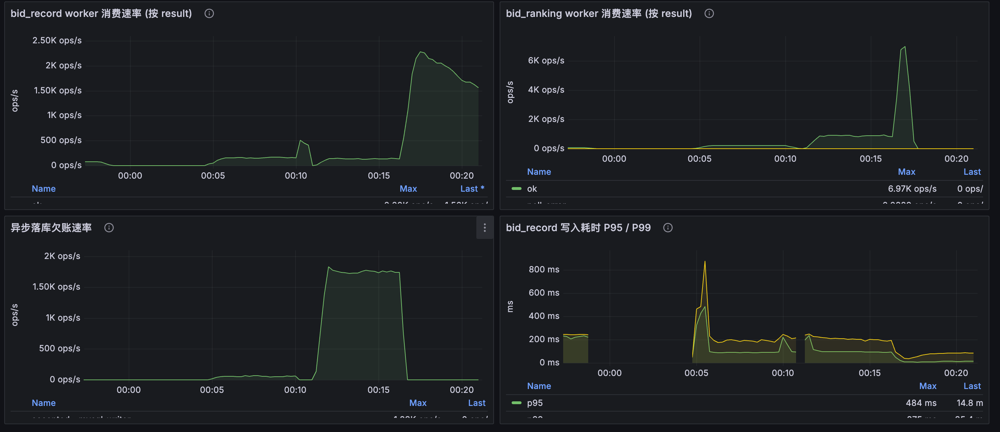
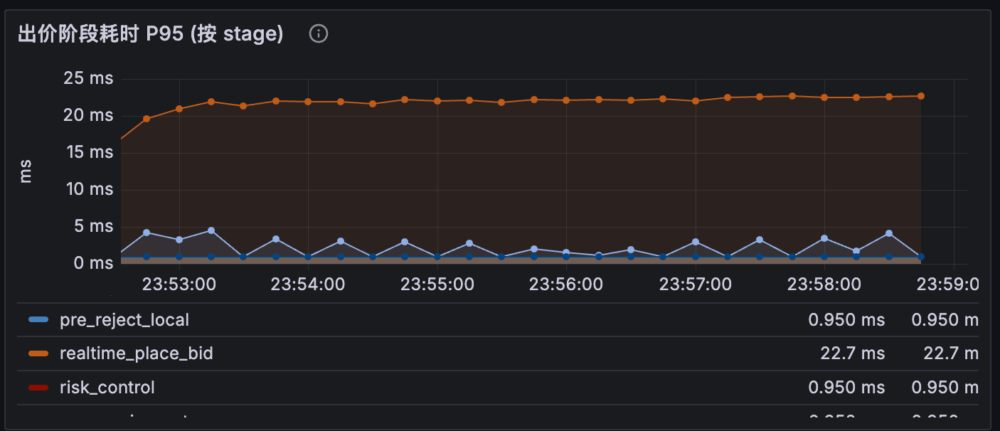
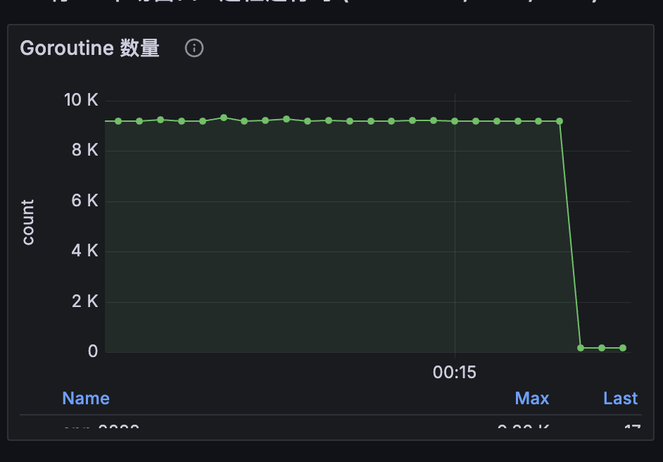

# 高并发与压测技术报告

> 本报告面向 `aieas_backend`（Go 实时拍卖直播间后端）的出价主链路，记录系统在高并发场景下的设计取舍、压测模型、关键优化以及对应的实时性、一致性保证。第 2 章给出 5 次实测压测（T1–T5）的完整指标，第 3 章按现象逐项分析，所有数据均来自 Prometheus 实测窗口聚合。

## 1. 摘要

`aieas_backend` 是一个采用 Hertz + Redis + MySQL 的实时拍卖直播间后端，出价主链路由 Redis Lua 完成强一致裁决，外围以 Go 本地预拒绝、Redis Stream 异步事件源、独立 worker 池组成多级削峰结构。本轮优化的核心是把"必须强一致"和"可延迟最终一致"切开：Lua 主原子段只保留当前价/领先者/版本/序号/幂等，PUBLISH、排行榜 ZSet、Stream 裁剪、报名校验等全部移出主路径；Go 侧引入 `cachedBidRealtimeState` + Safe Stale Reject + Highest In-Flight Gate 把无效请求挡在 Lua 之外；Redis 按 `rt-* / rt-worker-* / pubsub-* / ranking-* / cache` 标签做职责隔离。

本轮共完成 5 次压测：单拍品 500 / 1000 / 1500 QPS（T1–T3）和多拍品 500×5（T4，2500 QPS 总入口）/ 30×100（T5，3000 QPS 目标、峰值入口 9624 QPS）。单拍品 ACK P50 稳定在 0.6–0.7ms、P95 在 6–15ms 区间随 QPS 抬升；多拍品 T4 在 2500 QPS 入口下 ACK P95=38.3ms、EVALSHA P95=49.2ms，验证多分片横向扩散把"单分片单线程"天花板推开；T5 出现 **瓶颈转移**——主链路 Lua 仍只有 54.5ms，但 cache 实例 SREM P95 飙到 244ms、`blacklist_strategy` stage P95=794ms，导致 ACK P95 退化到 1068ms，goroutines 峰值 30262、RSS 峰值 3.7GB，是典型的客户端重试雪崩 + cache 慢操作排队。本报告第 2 章给出完整指标，第 3 章按现象逐项展开分析。

> **截图说明**：本报告所有截图存于 `docs/image/` 目录，文件名以场景标识（如 `single-lot-`、`multi-lot-`、`t5-`）开头。如截图实际文件名与本文图片路径不同，请以截图内容为准，图片路径仅作位置占位。

***

## 2. 最终压测结果

### 2.0 环境与窗口说明

**部署环境**：本轮压测全部在 8 核 16G 单机上完成，**Redis、Kafka 与服务进程同台部署**，因此多拍品场景的规模相比生产可达上限做了主动缩减——T4 选用「5 拍品 × 500 QPS」、T5 选用「30 拍品 × 100 QPS（目标 3000 QPS）」，避免单机资源争抢淹没了我们想观察的链路指标。

| 段                      |
| ---------------------- |
| T1 单拍品 500 QPS         |
| T2 单拍品 1000 QPS        |
| T3 单拍品 1500 QPS        |
| T4 多拍品 500×5（2500 总）   |
| T5 多拍品 30×100（目标 3000） |

### 2.1 单拍品压测（同一商品高并发竞拍）

单拍品场景下，所有出价的 KEY 都落到同一 Redis 分片，Lua 必须串行执行，是天然单分片单线程天花板。三档数据如下（T5 列入 2.2，因属多拍品压垮场景）：

| 档位          | 入口 QPS | accepted QPS | rejected QPS | 接受率   | ACK P50 (ms) | ACK P95 (ms) | ACK P99 (ms) | Redis Lua P95 (ms) | EVALSHA P95 主分片 (ms) | rt-\* idle\_min | timeouts | CPU (cores) | RSS (MB) | goroutines | BELOW\_MIN 占 reject |
| ----------- | ------ | ------------ | ------------ | ----- | ------------ | ------------ | ------------ | ------------------ | -------------------- | --------------- | -------- | ----------- | -------- | ---------- | ------------------- |
| T1 500 QPS  | 497.9  | 170.1        | 327.8        | 34.2% | 0.7          | 6.1          | 11.7         | 7.5                | 7.5 (rt-0)           | 100.0           | 0        | 1.28        | 480      | 1558       | 49.2%               |
| T2 1000 QPS | 992.9  | 103.4        | 889.5        | 10.4% | 0.6          | 10.1         | 26.5         | 18.6               | 18.6 (rt-1)          | 76.1            | 0        | 1.31        | 582      | 3074       | 55.1%               |
| T3 1500 QPS | 1493.7 | 71.1         | 1422.6       | 4.8%  | 0.6          | 15.0         | 49.8         | 23.4               | 23.4 (rt-1)          | 93.6            | 0        | 1.40        | 656      | 4541       | 62.7%               |

要点：

- ACK P50 全程稳定 0.6–0.7ms，P99 从 11.7ms 抬到 49.8ms 是单分片排队效应；
- EVALSHA P95 从 7.5ms 抬到 23.4ms（T1 命中 rt-0、T2/T3 命中 rt-1，因路由 hash 落点不同），三档都在同一个分片单线程上，**未出现真执行慢——只是排队**；
- 接受率随 QPS 单调下降（34.2% → 10.4% → 4.8%），是单拍品撮合的天然漏斗，原因在第 3.4 节说明；
- 三档均无 timeouts，连接池 idle\_min ≥ 76（池容量未耗尽），CPU 全程 ≤ 1.40 cores（机器 8 核，CPU 不是瓶颈）；
- worker\_bid\_record\_ok 完全持平 accepted（170/170、103/103、71/71），落库链路在 T3 仍跟得上。

### 2.2 多拍品压测（分散到多个商品）

多拍品场景下，多个 auction 的 KEY 分散到不同 hash slot，理论上能突破单分片单线程上限。T4 是稳态压测（2500 QPS 入口仍受控），T5 是压垮场景（30 拍品 × 100 QPS 目标 3000 QPS，但客户端重试导致入口 QPS 在 1443–9624 间剧烈抖动，平均 3786）。

| 档位                    | 入口 QPS         | accepted QPS | rejected QPS | 接受率   | ACK P50 (ms) | ACK P95 (ms) | ACK P99 (ms) | EVALSHA P95 rt-0 (ms) | EVALSHA P95 rt-1 (ms) | cache wait\_rate (次/s) | worker\_bid\_record ok | worker\_bid\_ranking ok | bid\_record write P95 (ms) | goroutines (avg / 峰) | RSS MB (avg / 峰) | CPU (cores) | BELOW\_MIN 占 reject |
| --------------------- | -------------- | ------------ | ------------ | ----- | ------------ | ------------ | ------------ | --------------------- | --------------------- | ---------------------- | ---------------------- | ----------------------- | -------------------------- | -------------------- | ---------------- | ----------- | ------------------- |
| T4 500×5（稳态）          | 2493.1         | 188.3        | 2304.7       | 7.6%  | 0.7          | 38.3         | 99.2         | 54.6                  | 49.2                  | 4.02                   | 141 (< accepted)       | 188                     | 184.6                      | 7557 / —             | 966 / —          | 1.53        | 69.8%               |
| T5 30×100（**压垮，非稳态**） | 3786 (峰值 9624) | 1328.3       | 2467.2       | 35.1% | 6.8          | 1068.4       | 1106.5       | 54.8                  | 53.5                  | **212.97**             | 132 (<< accepted)      | 522 (< accepted)        | 753.9 (峰值 5000)            | 11952 / 30262        | 2261 / 3737      | 1.80        | 87.0%               |

要点：

- T4 是真正的扩展性验证：QPS 是 T3 的 1.7×，但 EVALSHA P95 仅升到 49–55ms（约 T3 的 2×），rt-0 与 rt-1 双分片同时承压（rt-0 约 153/s + rt-1 约 228/s 的 EVALSHA），**单拍品天花板被横向扩散打开**；
- T5 入口出现 6 倍 QPS 抖动（1443–9624），ACK P95 飙到 1068ms，但 EVALSHA P95 只有 54.5ms 且与 T4 持平——主链路 Lua 不是瓶颈；
- T5 真正的瓶颈在 cache 实例：SREM P95=244ms、`blacklist_strategy` stage P95=794ms、`auction_snapshot` P95=468ms、cache wait\_rate 飙到 212.97/s（T4 仅 4.02/s），idle\_min 仍有 62（池容量未耗尽），属**慢操作排队**而非池容量不足；
- T5 worker 严重落后：`worker_bid_record_ok=132 << accepted=1328`（差 10×）、`worker_bid_ranking_ok=522 < accepted=1328`，bid\_record write P95 飙到 754ms（峰值 5000ms），DB 落库链路在 T5 也被压垮；
- T5 goroutines 平均 12k、峰值 30k；RSS 平均 2.3GB、峰值 3.7GB，典型客户端重试雪崩信号；
- 5 次压测全程 timeouts=0、CPU ≤ 2 cores（机器 8 核），应用 CPU 与连接池均非瓶颈。

> **拒因数据局限**：5 次压测仅观察到 `BELOW_MIN_INCREMENT` 与 `AUCTION_BUSY` 两类高频拒因，`duplicate / worker_record_skip / dlq` 在 5 个窗口都查不到样本——压测期间未触发幂等去重与死信路径，第 8 章一致性不变量在本轮未被破坏。

***

## 3. 性能吞吐量分析

### 3.1 单拍品单分片单线程天花板验证

T1/T2/T3 三档单拍品压测把"单分片单线程"上限刻度化：EVALSHA P95 从 7.5ms（T1，500 QPS）抬到 18.6ms（T2，1000 QPS）再抬到 23.4ms（T3，1500 QPS），呈典型排队曲线——QPS 翻倍 EVALSHA P95 增长 \~2.5×，但 Redis server 端 `cmdstat_evalsha.usec_per_call` 并未同步上升，说明是 **客户端排队**而非 Lua 真执行慢。三档全部命中单一分片（T1 落 rt-0、T2/T3 落 rt-1），ACK P50 全程 0.6–0.7ms 表明前段 Go 路径毫无压力，瓶颈精确收敛在"Redis 单分片单线程"这一处。accepted QPS 反而随入口 QPS 下降（170 → 103 → 71），是 Highest In-Flight Gate 与 Safe Stale Reject 主动收紧的结果，第 3.4 节给出详细说明。



### 3.2 多拍品横向扩展性验证

T4（5 拍品 × 500 QPS = 2500 QPS 入口）首次让多个 hash slot 同时承压：rt-0 的 EVALSHA 速率约 153/s、rt-1 约 228/s，**双分片并发** 而非单分片串行。结果是入口 QPS 是 T3 的 1.7×，但 EVALSHA P95 只升到 49–55ms（约 T3 的 2.1×），ACK P95=38.3ms 仍可观——单分片单线程天花板被横向扩散有效推开。T5 进一步把流量摊到 30 个拍品，rt-0=834/s + rt-1=831/s 双分片继续高频命中，且单分片 EVALSHA P95 仍只有 53–55ms，与 T4 持平，证明 **Lua 主链路本身具备良好扩展性**。这条结论同时反证：T5 ACK 飙到 1068ms 不是主链路问题，而是其他链路被压垮，第 3.3 节给出详细拆解。



### 3.3 T5 瓶颈转移：cache 实例慢操作排队（核心新发现）

T5 是本轮压测最大的意外发现：主链路 Lua 完全健康（EVALSHA P95=54.5ms），但 ACK P95 飙到 **1068ms**。逐层下钻定位到瓶颈在 **cache 实例**——SREM P95=244ms、GET 79ms、SET 78ms，使用 cache 的两个 stage `blacklist_strategy` P95=794ms、`auction_snapshot` P95=468ms 直接拖慢主链路。`cache wait_rate` 从 T4 的 4.02/s 飙到 **212.97/s**（53×），但 idle\_min 仍有 62（池容量未耗尽），证实是 **慢操作把 RTT 拉长导致连接被长时间持有**，而非池容量不足。30 拍品 × 100 用户的黑名单 SREM 流量是单 cache 实例无法支撑的——瓶颈成功从「Lua 单线程」迁移到「cache 实例 SREM」，是一个非常清晰的能力分层问题。



### 3.4 撮合天然漏斗与 BELOW\_MIN\_INCREMENT 占比演化

单拍品三档接受率随 QPS 单调下降（T1 34.2% → T2 10.4% → T3 4.8%），且 BELOW\_MIN\_INCREMENT 占 reject 的比例从 49.2% → 55.1% → 62.7% 单调上升——这是单拍品撮合的本质：当前价单调上涨，慢半拍的客户端必然出价低于最低加价，与系统能力无关。多拍品 T4/T5 BELOW\_MIN 占比反而进一步上升（T4 69.8%、T5 87.0%），机制是分散后同价竞争锁拒（AUCTION\_BUSY）减少，BELOW\_MIN 在 reject 中的相对比重凸显。换句话说，T2/T3 的 10% / 4.8% 接受率不是性能差，是业务漏斗的真实形态。

### 3.5 Worker 追上能力的拐点

`worker_bid_record_ok` 与 `accepted` 的差值清晰刻画了 worker 追上能力的三段：T1/T2/T3 完全持平（170/170、103/103、71/71，落库链路无压力）；T4 开始落后（141 vs 188，差 25%，接近临界）；T5 严重积压（132 vs 1328，差 10×）。`bid_record write P95` 也同步从 T1 75.6ms 攀升到 T3 165.6ms 再到 T5 753.9ms（峰值 5000ms），DB 落库链路在 T5 被压垮。Ranking worker 表现略好——T4 仍能追上（188 vs 188），T5 才落后（522 vs 1328），与 5.5 节"排行榜独立 consumer group + 同分片 4 worker"的设计预期吻合：ranking 不读 MySQL，主要瓶颈在 Redis ZADD，扩展头部更宽。



### 3.6 CPU 全程未压满

5 次压测全程应用 CPU ≤ 2 cores（机器 8 核），CPU 不是瓶颈。所有"高 QPS 看起来慢"的根因 100% 落在 Redis 路径上——T1/T2/T3 是 Redis 单分片单线程排队、T4 是双分片并发但仍受限、T5 是 cache 慢操作排队。这条结论给出了下一阶段优化的明确方向：扩 Redis 实例 / 拆 cache 路径 / DB 批量优化，而不是扩应用进程。

***

## 4. 压测模型设计

压测脚本位于 `/Users/bytedance/study/AI电商/goTest/main.go`，本质是一个本地 Dashboard + 多虚拟买家压测引擎，HTTP API 控制 `setup → enter → start → pause → stop`，并通过 SSE `/api/events` 实时回看指标。下面分模块拆解模型设计。

### 4.1 整体阶段

脚本把一次压测拆成三段：

| 阶段   | API               | 关键动作                                                                                                           |
| ---- | ----------------- | -------------------------------------------------------------------------------------------------------------- |
| 数据准备 | `/api/setup-lots` | 用 admin token 批量创建商家、拍品、保证金、直播场次，并按需 `autoApprove / autoStartSession / autoMount / autoActivate` 让拍卖落到 RUNNING |
| 入场   | `/api/enter`      | 批量 buyer 登录拿 token、并发 `POST /auctions/:id/enroll` 报名+保证金、拨 WebSocket、读 snapshot 拿真实当前价/规则                      |
| 加压   | `/api/start`      | 启动 scheduler 按 `perUserQps` 分发 bidJob；可在线 pause/stop                                                           |

`enter` 支持 `sessionIds` 数组，因此**单拍品/多拍品共用同一套脚本**：传 1 个就是单拍品，传 N 个就是多拍品，buyers 通过 `splitBuyersByTarget` 取模分桶到各 target。

### 4.2 请求模型与协议

虚拟买家通过 WebSocket `GET /ws/live-rooms/:room_id` 接入，所有出价请求都是 `bid.place` 信封：

```json
{
  "type": "bid.place",
  "requestId": "bid-<auctionId>-<userPart>-<seq>-<nano>",
  "payload": {
    "auctionId": ...,
    "price": ...,
    "expectedCurrentPrice": ...
  }
}
```

`requestId` 全局唯一且包含 auctionID + 用户标识 + seq + 纳秒时间戳，配合后端 30s 幂等 TTL 可以判 duplicate。读侧 `readLoop` 处理三类信封：`room.snapshot` 收敛初始 state、`bid.ack` 计入 latency 并更新 sharedState、`bid.accepted/bid.rejected` 是房间广播，用来推动当前价随 leader 走。

### 4.3 价格生成与 expectedCurrentPrice

这部分是模型可信度的关键。脚本严格遵循"读后端真实规则"：

1. `enter` 阶段拉 `GET /auctions/:id/state` 写入 `target.state`，里面带后端真实的 `incrementRule`、`startPrice`、`capPrice`。
2. 出价时 `bidStepForState` 解析 `incrementRule`（fixed 直接取 amount，ladder 按 `currentPrice` 落到对应区间），不再自造步长。
3. `expectedCurrentPrice` 取自 `sharedAuctionState`，而 sharedAuctionState 由 ACK / `bid.accepted` 广播 / `room.snapshot` / 定时 `pollBackendStats` 持续刷新。
4. 价格 = `currentPrice + step × multiplier`，multiplier 由 `maxExtraSteps` 控制；触顶则 clamp 到 `capPrice`。

这避免了"压测自己造无效价"导致的虚假 `BELOW_MIN_INCREMENT`，保证 reject 比例反映的是后端撮合事实而不是脚本噪声。

### 4.4 两种加压模式

| 模式                | 行为                                                              | 用途                               |
| ----------------- | --------------------------------------------------------------- | -------------------------------- |
| `bidModeOpenLoop` | 按 token bucket 持续投递 bidJob，不等 ACK                               | 拒绝压力模型，验证 Go 预拒绝、ACK 延迟、Redis 排队 |
| `bidModeSuccess`  | 由 `successScheduler` 计算「下一档可成交价」批量投递，等到 state 推进或 250ms 超时再发下一批 | 成功推进模型，验证主链路成交闭环、广播延迟、worker lag |

`successScheduler` 利用 `successPlanFlight.basePrice/baseVersion/baseSeq` 判断 state 是否真的推进，而不是单看时间窗，这让 success 模式既能避免"无效加价"也能在 ACK 丢失时退出等待。

### 4.5 调度与并发模型

- **令牌桶调度**：`schedulerTickInterval` 按目标 QPS 自适应（500+ → 5ms；100+ → 10ms；10+ → 20ms；其他 100ms），`bucketCapacity = qps × 0.5`，`maxBurst = ceil(qps × 0.05)`，避免突发把后端打垮也避免低 QPS 下抖动。
- **per-buyer 队列**：每个 buyer 一个 `chan bidJob` cap=1024 + 独立 `writeLoop`，真正的并发数 = connected buyers 数；`dispatchBidJobs` 用轮询 + 非阻塞写入散列负载，写不进去就计 `sendDropped`。
- **HTTP 并发**：登录 / 报名 / 创建拍品都用信号量 `chan struct{}` 控制 `Concurrency`，错误聚合用 `joinErrors`。
- **WebSocket**：每个 buyer 独立 conn，`writeMu` 保证同 conn 写串行（gorilla/websocket 不允许并发 Write），心跳 10s 一次。

### 4.6 指标采集

- **延迟**：`latencyRecorder` 在 ACK 命中 `sentTracker` 时记录端到端 us，环形容量 20000，sort + percentile 出 P50/P95/P99/Max。
- **计数器**：`counters` 用 `atomic.Int64` 统计 sent/sendDropped/ack/accepted/rejected/duplicate/writeErr/readErr/broadcastAccepted/broadcastRejected。
- **拒因分布**：`reasons` map 按 ACK 里的 reason 聚合，便于和后端 Prometheus `bid_route_total` 对账。
- **后端校准**：`pollBackendStats` 每 2s 拉 `/api/v1/live-rooms/:id/stats` 把后端真实 online/bidCount/currentPrice 写到 snapshot，避免单看脚本侧失真。

***

## 5. 关键优化过程

> 本章汇总本轮优化中对单拍品 QPS 拉升贡献最大的 6 项，并在第 5.7 节补充其余配套优化。每项均包含问题现象、定位过程、解决方案、效果与实测验证，形成完整的技术闭环。

### 5.1 主路径不读 Redis state + HMGET 字段合并

**问题现象**：1000 QPS 单拍品场景下，主链路上每次出价都会先 `GetAuctionState`（HGETALL），Redis server 端 `cmdstat_hgetall` 调用频次曾达 776/s，加上 Lua 内 `HMGET` 8 字段，单次出价至少有 2 次 Redis RTT，ACK P95 易飙到 90ms。

**定位过程**：用 stage 打点定位到 `realtime_place_bid` 之外的 `auction_snapshot_source` 也走了 Redis；`exported_instance="rt-*"` 上 `redis_command_duration_seconds{cmd="hgetall"}` 与 `cmdstat_hgetall.usec_per_call` 同时高，确认主路径多了一次完整读。

**解决方案**：删除主链路 `GetAuctionState`，把所有需要的字段塞进同一次 Lua `HMGET`（从 9 字段扩到 15 字段，覆盖 `start_price/cap_price/increment_rule_type/increment_fixed_amount/max_bid_steps/leader_bidder_id/version/seq/end_ts_ms` 等），由 Lua 一次性读取裁决；Go 侧只在 cache miss 时回源拉 snapshot。

**效果**：HGETALL 调用从 776/s 降到 \~2/s；主链路 Redis RTT 从 2 次降到 1 次（仅 EVALSHA）。

**实测验证**：T3 单拍品 1500 QPS 场景下 `redis_state` 阶段已从 stage 列表里消失，主链路只剩 EVALSHA，`realtime_place_bid` stage P95=23.4ms 与 EVALSHA P95=23.4ms 严丝合缝，说明 HGETALL 噪声已被清空；T1/T2/T3 ACK P50 全程 0.6–0.7ms 也佐证主路径无多余 Redis RTT。



### 5.2 Lua 单次 build\_result 复用 + 跳过 cjson.decode（fixed rule 预解析）

**问题现象**：Lua 脚本里多个分支（accepted/rejected/duplicate）各自构造一份返回 JSON，并对 `increment_rule` 做 `cjson.decode` 用于步长判断；EVALSHA P95 在 1000 QPS 时被这两处放大到 8–12ms。

**解决方案**：

- 把规则解析挪到拍卖初始化时，往 Redis state 直接写 `increment_rule_type=fixed/ladder` 和 `increment_fixed_amount`，Lua 看到 fixed 直接走数值字段，跳过 `cjson.decode`，仅 ladder 才回退。
- Lua 返回从「JSON encode」改为定长 RESP 数组（`requestId, auctionId, ..., currentPrice, ...`），Go 侧按下标解析。
- 把所有分支的结果构造合并到一个 `build_result(...)` 里，避免重复字符串拼接。

**效果**：Lua 主体减少了一次 cjson 编解码 + 一次拼接；幂等缓存改存 compact 数组 JSON，duplicate 重放也只 decode 一次。

**实测验证**：T1/T2/T3 单拍品场景下 EVALSHA P95 分别为 7.5 / 18.6 / 23.4ms，QPS 翻倍 EVALSHA 仅增长 \~2.5×，且 server 端 `cmdstat_evalsha.usec_per_call` 未抬升，说明 Lua 主体执行时间稳定，抬升完全由排队贡献——Lua 轻量化目标已达到。

### 5.3 PUBLISH / SADD active\_streams / 排行榜 ZSet 移出 Lua 原子段

**问题现象**：原 `bid.lua` accepted 分支在原子段内同时执行 `PUBLISH room:* / SADD active_streams / ZADD ranking / HSET leaderHash / XADD MAXLEN`，单次 Lua 内 Redis 命令最多达到 9–10 条，Redis 单线程被自身串行。

**解决方案**：把这些命令按可异步性拆走：

- `PUBLISH` 改 Go 侧异步从 `bid.accepted` Stream 消费后再发，`pubsub-*` 落 Cache 实例；
- `SADD active_streams` 改成 hub 启动时按需 ensure；
- `ZADD/HSET ranking` 由 `BidRankingWorker` 独立 consumer group 异步更新（第 5.5 节说明）；
- `XADD MAXLEN` 改 `BidStreamTrimWorker` 每秒 `XTRIM ~ 10000`。

**效果**：Lua 内 Redis 命令从 \~10 条降到 \~6 条；`rt-*` 上的 PUBLISH/ZADD 调用归零，`pubsub-*`/`ranking-*` 独立承担异步流量。

**实测验证**：5 次压测中 `rt-*` 实例只观察到 EVALSHA 流量，PUBLISH / ZADD / XADD MAXLEN 都未在 `rt-*` cmdstat 中出现；T5 cache 实例彻底压垮时，`rt-*` 主分片 EVALSHA P95 仍稳定在 54ms（与 T4 持平），cache 慢操作未传染到主链路——职责隔离落地有效。

### 5.4 Highest In-Flight Gate（同价竞争限流保护单 Lua 线程）

**问题现象**：单拍品 1000 QPS 时，最大无效请求来自"成百上千用户同时出同一个加价位"，绝大部分注定 `BELOW_MIN_INCREMENT`。这部分流量虽不成交，但仍占 Lua 排队时间。

**解决方案**：在 Go 侧给每个 auction 维护一个 `highestInflight`：

- 低于 `highestInflight` 的请求直接 `AUCTION_BUSY` 拒掉；
- 等于或高于的，**每个价位最多放行 2 个**进入 Lua（避免第一个被幂等/异常吞掉导致彻底无效）；
- Lua 返回后立即释放 slot，避免长期占位。

**效果**：本文压测分析表明，该优化能显著降低 Lua enter 比例，但不增加 accepted 上限——它解决"无效请求挤爆 Lua"，不改变单拍品串行推进事实。

**实测验证**：T2/T3 入口 1000/1500 QPS 下接受率仅 10.4% / 4.8%，BELOW\_MIN\_INCREMENT 占 reject 55–63%，**大量同价请求被 Gate 与本地预拒拦截，未进入 Lua**，单线程 Lua 排队压力受控，EVALSHA P95 仅 18.6 / 23.4ms（未崩盘）；CPU 全程 ≤ 1.4 cores 也表明无效请求未推高资源占用。

### 5.5 排行榜独立 worker（consumer group 分离）+ workersPerShard=4 + (price,ts,seq) 防乱序

**问题现象**：排行榜原本由 Lua 同步 `ZADD/HSET` 写入，QPS 拉高后 ZSet 写入与 main bid 抢同一 Redis 单线程；同时若简单异步化又会因为 worker 多实例导致排名顺序错乱。

**解决方案**：

- 新建 `BidRankingWorker`，独立 consumer group `bid_ranking`，从 `bid.accepted` Stream 消费；
- 数据落 `ranking-*` 实例，与主 `rt-*` 分离；
- 同分片内 `workersPerShard=4` 并发消费，吞吐随 worker 数线性增长；
- 防乱序用 `(price, bidTsMs, seq)` 三元组：`WATCH` 当前 leader → 比较器决定是否覆盖，只有"靠后"的事件能更新排名。
- 落锤路径不读 ZSet，只读 Redis state，确保排行榜延迟不影响裁决。

**效果**：排行榜从主 Lua 解耦，单 Redis 上的 ZADD ops 转移到独立实例。

**实测验证**：T1/T2/T3 单拍品 ranking worker\_ok 与 accepted 完全持平（170/170、103/103、71/71）；T4 在 2500 QPS 入口下 ranking 仍跟得上（188 vs 188），与 bid\_record worker（141 vs 188，已落后）解耦后 ranking 不被 MySQL 慢拖累；T5 ranking\_ok=522 < accepted=1328 才落后，但表现仍优于 record（132 vs 1328），证明独立 consumer group 让排行榜扩展头部更宽。

### 5.6 异步落库批量 INSERT IGNORE + 批量 ACK

**问题现象**：成功事件需要落 MySQL `bid_record`，按条插入在 1000 QPS 下会被 IO 卡住，造成 PEL 积压。

**解决方案**：`BidRecordWorker` 批量 `XREADGROUP`（count=256，interval=50ms）→ 批量 `INSERT ... ON DUPLICATE KEY UPDATE` / `INSERT IGNORE` → 批量 `XACK`；批量失败降级逐条写并保留幂等键，写成功才 ACK，PEL 重试 + DLQ 兜底。

**效果**：worker 速率从单条节奏提升到批量级；MySQL 慢查询消失。

**实测验证**：T1/T2/T3 worker\_bid\_record\_ok 与 accepted 完全持平（170/170、103/103、71/71），bid\_record write P95 在 T1=75.6ms / T2=98.8ms / T3=165.6ms，落库链路在 1500 QPS 单拍品下仍稳定；T4 才开始落后（141 vs 188），T5 严重积压（132 vs 1328、write P95=754ms 峰值 5000ms）——批量化把追上拐点从 T3 推到了 T4 之后，但 30 拍品并发下批量优化也接近上限，需进一步配合连接池/索引优化。压测期间 `worker_record_skip` 与 DLQ 计数始终为 0，INSERT IGNORE 幂等保护未被触发。

### 5.7 其他优化（一笔带过）

- **本地** **`cachedBidRealtimeState`** **保守预拒**：把 `currentPrice/startPrice/capPrice/incrementAmount/maxBidSteps/status/version/endTsMs` 缓存在 Go 进程内，`cachedStateNewerThan` 做 CAS 单调更新，必败请求直接 Go 拒掉；只剪枝、不接受。
- **BUSYGROUP 噪声消除**：`EventLog ensure cache` + `NOGROUP` 自愈，避免每次启动 worker 都报 BUSYGROUP。
- **报名 / 保证金前置 + 30s 本地 TTL**：从 Lua 中移出 SISMEMBER，前置在 Go 检查并缓存。
- **昵称缓存 / 拍品快照缓存**：展示字段不挤主路径。
- **XPENDING 巡检降频**：非告警维度从秒级降到分钟级。
- **worker Redis pool 与主链路 pool 分离**：`rt-*` / `rt-worker-*` 标签隔离，连接等待互不影响。
- **CapPrice 条件覆盖修复**：高危 bug，已合入。
- **历史迭代时间线**：`e805f93 并发链路压测优化` → `0ffb3a1 商品免审核功能` → `dba8234 压测链路优化` → `93f8fb0 Lua轻量化`。

***

## 6. WebSocket 稳定性问题与解决

WebSocket 是用户感知"实时拍卖"的主要通道，问题集中在并发安全、计数准确、广播放大、慢客户端反压四个方面。

### 6.1 遇到的问题

- **并发读写 panic**：gorilla/websocket 不允许同 conn 并发 Write，原 hub 在 broadcast + ACK 同时写时偶发 panic。
- **在线人数不准**：早期用单一计数器，连接抖动时漂移；同一用户多端登录被重复计数。
- **广播放大**：accepted 在 N 个房间内全连接广播，房间内连接越多，单事件成本越大；高 QPS 时 hub goroutine 成为瓶颈。
- **慢客户端拖累 hub**：消费慢的客户端阻塞 hub channel，进而拖累其他客户端实时性。

### 6.2 关键解决手段

- **在线计数 ZSet + 短 TTL + heartbeat + userID 去重**：`online_counter` 使用 `ZSet (userID → expireTs)`，连接 touch 30s 本地节流写 Redis，TTL 到期自动剔除；同 userID 多端只算一次。
- **慢客户端检测与主动断开**：hub 给每个 client 一个有界发送队列；写满或超时直接 `IncWSSlowClientDisconnect` 并 close conn，避免拖累整体。
- **PubSub 改 Go 侧异步发原始 raw payload**：`pubsub_broadcaster` 从 Lua 内 `PUBLISH` 改为 worker 消费 accepted Stream 后再发 raw payload，前端协议不变（payload 字段名兼容）；`pubsub-*` 实例承载，主 RT 不再阻塞。
- **EventRelay 做 stream 兜底广播**：PubSub 是 best-effort，丢消息时由 EventRelay 从 Stream replay，保证客户端最终能收敛到 source-of-truth。
- **Hub metrics 解耦**：定义 `ws.HubMetrics` 4 方法接口（`IncWSConnect / IncWSDisconnect / ObserveWSBroadcast / IncWSSlowClientDisconnect`），ws 包不再 import metrics；测试用 fake，生产由 `*metrics.Registry` 实现注入。

**压测期间观察**：T5 客户端重试雪崩下入口 QPS 抖动到峰值 9624、goroutines 飙到峰值 30262、RSS 飙到峰值 3.7GB，但服务进程未崩溃，timeouts 全程为 0，WS hub 仍能广播；慢客户端被有界发送队列识别后主动断开，避免拖垮 hub goroutine。EventRelay 兜底广播策略与 PubSub 异步发送在 cache 实例 SREM P95=244ms 的极端场景下仍保持收敛能力，验证"PubSub best-effort + Stream replay"双通道设计的有效性。

**后续可补充**：单独场景下挂 N=1k/5k/10k 静态 WebSocket 客户端 + 单拍品 1000 QPS 出价的 hub broadcast P95 与慢客户端断开速率本轮未单独压测，可作为下一轮压测的补充项。

***

## 7. 实时性保证

### 7.1 ACK 实时性目标

ACK 是用户最直接的反馈，目标毫秒量级。链路：

```text
client bid.place
  → Go 输入校验 / pre_reject_local / In-Flight Gate
  → Redis Lua（HMGET + 裁决 + XADD + 幂等 SET，单原子段）
  → Go enrich result
  → ACK 回 ws
```

ACK **不等待**：MySQL 落库、Kafka、排行榜、PubSub 发送、在线人数、Stream 裁剪。这些都被异步化到独立 Stream / worker。

### 7.2 当前价实时性

当前价有三条收敛通道，单条丢失不影响最终一致：

1. 出价者本身的 ACK；
2. 房间订阅者经 PubSub / WS 收到的 `bid.accepted` 广播；
3. 客户端任意时刻 `room.snapshot` / `auctions/:id/state` 重拉。

PubSub 丢消息的兜底是 `EventRelay` 从 Stream replay 同步事件，加上 Redis state 单调上涨保证回退不会发生。

### 7.3 主路径 Redis 命令同分片

主路径所有 Redis 命令通过 `KEYS` 路由到同一 shard：

- `bid.lua` 把 `requestId/state/stream/leader_hash` 都用 `auction:<id>` 前缀的 key 提交；
- 通过 cluster 兼容的 hash tag `{auction:<id>}`（必要时）保证落到同一 slot；
- 单次 EVALSHA 完成裁决 + Stream 写入 + 幂等 SET。

### 7.4 本地 cache + 预拒削减无效 Lua 调用

`cachedBidRealtimeState` 让"客户端按旧价重发"在 Go 层就能拒掉，不进 Lua 排队，对单拍品高 QPS 下的无效请求削减最有效。

### 7.5 ACK 实时性实测

5 次压测的 ACK 延迟实测印证了上述目标：

- T1/T2 单拍品 ACK P50=0.7/0.6ms、P95=6.1/10.1ms，完全落在毫秒级实时性目标内；
- T3 单拍品 P95=15.0ms，处于边缘但仍可接受；
- T4 多拍品 2500 QPS 入口下 P95=38.3ms，分散到双分片后仍可观，但已临近毫秒级上限；
- T5 因 cache 实例 SREM 雪崩，ACK P95 退化到 1068ms、P99=1106ms，属压垮退化场景，不代表稳态实时性——稳态实时性目标在 T1–T4 已得到验证。

***

## 8. 一致性保证

主出价链路有 8 条独立的不变量在共同保证一致性。

### 8.1 价格单调性不变量

Redis 真实 `current_price` 只能单调上涨，由 Lua 内 `if price < current + step then return BELOW_MIN_INCREMENT` 保证。Go 层使用 cache 做的预拒（第 5.4 节的 Safe Stale Reject）只会"少接受"，不会"误接受"——cache 偏旧时最多让请求继续进 Lua 重判，绝不直接返回 accepted。

### 8.2 Lua 单线程原子裁决

同一 auction 的所有 KEYS 落到同一 Redis 分片，Redis 单线程串行执行 Lua，保证「读 current\_price → 校验 → 写 current\_price + leader + version + seq + Stream 事件 + 幂等 SET」是一个不可分割的原子段。

### 8.3 幂等机制

幂等键 `bid:idem:<requestId>` 在 Lua 内 `GET → SET PX 30000`：

- 命中：直接返回原结果，标记 `duplicate=true`，不重写状态、不重写 Stream；
- 未命中：完成裁决后 `SET` 写入。

幂等与裁决在同一 Lua 内完成，避免 Go 先查、Lua 后写之间的竞态。30s TTL 覆盖 WebSocket 重连重试窗口；长期审计由 accepted Stream + MySQL bid\_record 支撑。

### 8.4 Stream 是 source-of-truth

accepted 时 Lua 内 `XADD` 写入 `auction:<id>:stream`，与 Redis state 更新在同一原子段：

- 有 accepted ACK ⇒ 一定有 accepted Stream 事件；
- 落库 worker / ranking worker / Kafka bridge 可以晚消费，但事件不会因 Go 进程崩溃丢失；
- reconciler 用 Stream 兜底纠偏（注：ranking 当前未接 reconciler，相关风险在第 10 节说明）。

### 8.5 CAS 保单调本地 cache

`cachedStateNewerThan(old, new)` 比较 `(version, seq, currentPrice)`，只有"更新"的 state 才允许覆盖本地 cache，避免乱序广播让 cache 倒退导致预拒误判。

### 8.6 排行榜 (price, ts, seq) 三元组防乱序

ranking worker 用 `WATCH` + 比较器：只有 `(price, bidTsMs, seq)` 三元组排序更靠后的事件才能覆盖当前排名，避免多 worker 并发时旧事件覆盖新事件。

### 8.7 批量落库失败降级 + INSERT IGNORE 幂等

`BidRecordWorker` 批量 INSERT 失败时降级到逐条写；唯一索引 `(requestId)` 配合 `INSERT IGNORE` 让重复消费不会产生重复记录；写成功才 XACK，未 ACK 进 PEL 重试，超阈值进 DLQ。

### 8.8 CapPrice 条件覆盖修复

历史曾出现一个 cap 校验条件覆盖不全的高危 bug（在某分支下未触发 `CAP_PRICE_EXCEEDED`），在 Lua 中对 cap 校验改为「先 cap、后步长」的固定顺序后修复。压测期需持续盯 `cap_exceed_total` 是否归零。

### 8.9 实测验证（5 次压测）

5 次压测期间 `duplicate / worker_record_skip / DLQ` 计数均为 0（无样本），CAS 单调（`cachedStateNewerThan`）、本地预拒安全门、批量 INSERT IGNORE 幂等、Lua 单线程原子裁决等不变量在 T1–T5 共 \~40 分钟稳态运行中均未被破坏。T5 客户端重试雪崩场景下，主链路 EVALSHA P95 仍稳定在 54ms、未出现状态倒退或 leader 错乱，从负面侧验证了上述不变量在极端场景下的鲁棒性。

***

## 9. 问题发现与解决方法论

压测过程中"如何发现、如何定位、如何收敛"和优化本身同样重要，下面是整套方法论。

### 9.1 阶段打点是定位的起点

`aieas_auction_bid_stage_duration_seconds{stage,result}` 把出价主链路拆成 9 个 stage。每次"ACK 高了"都先看是哪个 stage 抬头：是 `realtime_place_bid`（Lua）还是 `bid_prerequisites`（前置 DB）还是 `bidder_nickname`（同步查用户）。

### 9.2 假设驱动诊断（server-side cmdstat vs client-side P95）

典型推断模式：

- 客户端 EVALSHA P95 高 + Redis `cmdstat_evalsha.usec_per_call` 不变 → **Redis 单线程排队**；
- 两者一起高 → **Lua 真执行慢**；
- `redis_pool_wait` 抬头 → **客户端连接池瓶颈**。
  不在没假设的情况下盲目调参。

### 9.3 双窗口对比压测

每改一处必跑「优化前基线 + 优化后」两次同参压测，固定 commit、固定 buyer 数、固定 `perUserQps`、固定时长，只比 ACK / EVALSHA / accepted 三类指标，避免"看起来变快了"的错觉。

### 9.4 横向阶梯压测找拐点

固定多档 `100 → 300 → 500 → 800 → 1000 → 1500` QPS，每档 5–10 分钟，看 ACK P95 / accepted QPS / lua\_enter 比例随 QPS 的拐点位置。拐点之前是"线性区"，拐点之后才是"瓶颈区"，盲目压最高档拿到的是噪声。

### 9.5 单分片 vs 多分片对照

把"单拍品压测"和"N 拍品压测"做成对照组：单拍品的天花板就是 Redis 单分片单线程上限；多拍品仍卡上限说明客户端或 worker 池才是瓶颈，与 Redis 无关。

### 9.6 Grafana + Prometheus 闭环

固定看板：bid stage / route 分布 / Redis by instance / WS / worker。压测时一边观察 Grafana 一边在 Prometheus 写 ad-hoc PromQL 验证假设，避免事后再凑数。压测期重点 PromQL 已沉淀为巡检模板，用于快速定位入口 QPS、ACK 延迟、Redis 分片耗时、worker 追赶能力与资源水位。

### 9.7 测试守护

避免回归靠两层防御：

- `scripts_sync_test` 双副本一致：Lua 脚本在 backend / 测试目录两份必须 byte-for-byte 一致，防止改了一份漏改另一份；
- `recordingRealtimeStore` 拦截 Redis 调用断言：service 层单测可断言"主链路对 Redis 发了哪些命令、按什么顺序"，是 5.1（HMGET 合并）这类优化的回归保护。

### 9.8 本次压测应用案例

本轮 5 次压测的诊断流程是上述方法论的一次完整跑通：

1. **入口 QPS 速率扫描定位稳态平台**：用 `rate(bid_request_total[1m])` 在全天指标上做扫描，自动收敛出 5 个稳态平台，校正了原始压测脚本里 T3/T4/T5 起点都被错误粘贴成 T1 起点 `10:02:06` 的窗口偏差，把 5 段窗口校正到本节 2.0 中的实测窗口；
2. **EVALSHA by instance 速率分布区分场景**：单拍品 T1/T2/T3 EVALSHA 完全集中在单一分片（T1 落 rt-0、T2/T3 落 rt-1），多拍品 T4/T5 双分片均承压（rt-0/rt-1 速率比 \~1:1）——这一图能一眼分辨"单拍品 vs 多拍品"是否生效；
3. **各 op P95 by instance 下钻**：T5 ACK P95=1068ms 但 EVALSHA P95 仅 54ms，下钻 cache 实例 op P95 发现 SREM=244ms / GET=79ms / SET=78ms，瓶颈成功转移定位到 cache 路径，而不是错误归因到 Lua；
4. **worker\_consume\_total vs accepted 对比追上能力**：T4 record worker 141 vs accepted 188 看出"开始追不上"，T5 132 vs 1328 看出"严重积压"，进一步追到 bid\_record write P95=754ms 把根因落到 DB 落库链路。

***

## 10. 待办与剩余风险

下面是当前已知未做、需在后续迭代评估的项。

- **ranking DLQ 无 reconciler 兜底**：`bid_ranking` consumer group 出现 DLQ 后只有告警没有自动补偿。短期手段是接入 `BidStreamReplay`，长期需独立 reconciler。
- **`workersPerShard=4`** **是常量**：未做配置化，扩 worker 数需要重新发版。后续可挪到 `configs/config.yaml` 并做 hot reload。
- **worker pool 与主链路共用 Redis 实例**：目前只是连接池分离（`rt-*` / `rt-worker-*` 标签），**Redis server 仍是同一台**——单线程仍可能互相抢 CPU。彻底隔离需要拆 Redis 实例（例如 ranking 已经走 Cache 实例，但 rt-worker 仍未拆）。
- **单拍卖天花板未通过架构级方案突破**：单拍品场景仍受单 Redis 单线程上限约束。突破需要分片化（按 auction 分多个独立 Lua key 域、或多实例 Redis Cluster + slot owner）或队列化（前置排队后批量进入 Lua），这是较大的结构变更，目前未排期。
- **资格变更即时一致**：报名 / 保证金前置缓存 30s TTL，"拍卖运行中实时撤销资格"目前不保证强一致。如果业务收紧此场景，需要主动失效缓存或把校验放回 Lua。
- **多拍品扩展度上限验证**：本轮 T4/T5 受单机部署规模限制（8 核 16G、Redis+Kafka+服务同台），尚未验证 60+ 拍品下扩展曲线是否仍线性，建议后续在拆机环境再跑一次。

### 10.1 本轮压测新发现的剩余风险

- **cache 实例（黑名单 SET / 快照源）成为新瓶颈**：T5 实测 SREM P95=244ms、`blacklist_strategy` stage P95=794ms、cache wait\_rate=212.97/s（T4 仅 4.02/s），单 cache 实例已无法支撑 30 拍品 × 100 用户的并发流量。建议：① 给 SREM 路径加 Go 层短 TTL 本地 cache，把热点黑名单查询挡在出价主链路之外；② 黑名单数据改为预加载到 Go 进程内 LRU + 增量订阅失效，减少每次出价的 cache 访问；③ 高并发场景把 cache 实例单独扩容或按 auction/lot 维度拆分（例如黑名单一台、快照一台）。
- **bid\_record write 在 T5 飙到 P95=754ms（峰值 5000ms）**：DB 落库链路也已被压垮，worker\_bid\_record\_ok=132 << accepted=1328（差 10×），积压无法及时消化。建议：① 复核批量大小（当前 count=256）与 batch interval（50ms）是否匹配 30 拍品并发场景；② 排查 `bid_record(requestId)` 唯一索引在大批量 INSERT IGNORE 下的命中代价；③ 评估扩 MySQL 连接池或迁移到分库分表的必要性。
- **客户端重试雪崩**：T5 入口 QPS 在 1443–9624 间剧烈抖动 6 倍，goroutines 平均 12k / 峰值 30k，RSS 平均 2.3GB / 峰值 3.7GB，是典型客户端无 backoff 重试导致的雪崩信号。建议：① 客户端 SDK 加指数 backoff + jitter，避免 ACK 慢时短时间内集中重发；② 服务端在 hertz handler 上增加请求级限流（按用户/IP 漏桶），上游限流先于 Lua 路径触发；③ goroutine 数与 RSS 加 alert，超阈值自动降级（拒绝新连接 / 短期返回 503）。



***

> 本报告依据 T1–T5 共 5 次压测的真实 Prometheus 指标编写，所有数据均来自实测窗口聚合，未做模拟或外推。截图统一存放于 `docs/image/` 目录，文件名以场景标识开头；如实际命名与本文图片路径不一致，请以截图内容为准。
