# 出价链路压测优化复盘

> 视角：本文以我作为后端开发/压测执行者的第一人称记录整个过程。  
> 时间范围：从压测工具建设、首次压测、问题定位、后端优化，到当前阶段指标复盘。  
> 目标：把“我是怎么发现问题、怎么判断瓶颈、怎么改、改完怎么验证”的过程沉淀下来，后续继续压测时可以直接按这份文档推进。

## 1. 背景

我一开始要解决的问题不是单纯“接口能不能跑”，而是要判断实时拍卖出价链路在多用户、高 QPS 下能承受多少压力，以及瓶颈到底在 Go 后端、Redis Lua、WebSocket 广播、MySQL 落库，还是压测工具本身。

在讨论分布式部署时，我先明确了一点：多实例部署不等于一定要马上拆微服务。当前系统的核心瓶颈更可能出现在实时出价裁决链路，而不是服务边界划分本身。出价这种强一致、高竞争的路径，拆成微服务以后如果没有把状态一致性和链路延迟处理好，反而会引入 RPC 网络延迟、跨服务事务、排障复杂度等新问题。

所以我的基本判断是：

- 先把单体多实例能力、Redis 原子裁决、WebSocket 广播、异步落库打磨清楚。
- MySQL 不应该参与实时出价裁决。
- Redis Lua 负责实时一致性，Kafka/Stream/MySQL 负责最终记录。
- 压测先以真实买家行为为主，而不是只打一个孤立接口。

## 2. 压测目标

我给这次压测设定了几个目标：

1. 模拟真实买家行为：登录、获取直播场次、进入直播间、报名、建立 WebSocket、接收快照、持续出价。
2. 能在界面上手动控制压测：人数、并发窗口、每人 QPS、目标 QPS、出价模式、开始/停止。
3. 能看到实时指标：发送 QPS、后端统计 QPS、成交 QPS、当前在线人数、当前价、ACK P95。
4. 能在 Grafana 上拆解后端指标：总出价 QPS、成功率、拒绝原因、Redis/Lua 延迟、WebSocket 广播、bid_record 写入、Worker 消费速率、CPU/内存/连接数。
5. 通过逐步加压定位瓶颈，而不是一次性把系统打爆。

## 3. 压测工具建设

我单独新建了 `/Users/bytedance/study/AI电商/goTest` 作为压测工具目录，避免把压测逻辑混到业务后端项目里。

压测工具的核心能力包括：

- 通过 UI 配置目标服务地址。
- 手动登录控制账号。
- 加载当前可用直播场次。
- 选择某个直播场次。
- 批量生成买家账号或读取 Token。
- 批量进入直播间并建立 WebSocket。
- 进入前自动调用报名接口：
  - `POST /api/v1/auctions/:id/enroll`
  - 后端创建 `deposit_ledger`
  - 状态变为 `READY`
- 按配置的 QPS 发送 `bid.place` WebSocket 消息。
- 按 ACK 和广播更新本地当前价。
- 实时展示发送 QPS、成交 QPS、ACK P95 和拒绝原因。

我后来确认后端只接受如下出价格式：

```json
{
  "type": "bid.place",
  "requestId": "bid-10001-u1001-001",
  "payload": {
    "auctionId": 10001,
    "price": 129900,
    "expectedCurrentPrice": 128900
  }
}
```

所以压测脚本里不能再自定义一堆业务不存在的字段，比如 UI 上的“加价分”这种概念。压测工具需要根据后端暴露的 `incrementRule` 计算合法出价，而不是本地随便生成价格。

## 4. 第一阶段：接口与流程先跑通

最开始我遇到的不是性能问题，而是流程不完整和接口不匹配。

### 4.1 登录接口 400

我先看到登录接口返回：

```text
http 400: {"code":20001,"message":"参数不合法","data":null}
```

这个阶段我判断问题不在压测并发，而是压测脚本里的登录请求参数已经和后端当前接口不一致。后端接口变动以后，压测工具还在用旧参数，自然连直播场次都加载不了。

我把压测流程重新梳理成：

```text
登录买家账号
  -> 获取 Token
  -> 获取直播场次
  -> 选择直播场次
  -> 获取当前拍品/拍卖状态
  -> 报名
  -> 建立 WebSocket
  -> 等待 room.snapshot / auction state
  -> 开始出价
```

### 4.2 加价规则来源

一开始出现 `PRICE_STEP_MISMATCH` / `BELOW_MIN_INCREMENT` 时，我先怀疑是压测工具的本地价格生成逻辑不懂后端的加价规则。

后端后来明确加价规则会从这些链路下发：

- `GET /api/v1/live-sessions/:id/lots`
- `GET /api/v1/auctions/:id/state`
- `/ws/live-sessions/:session_id` 的 `room.snapshot`

这些返回里都会包含：

- `startPrice`
- `capPrice`
- `incrementRule`

我因此把压测工具改成从后端读取加价规则，并按规则计算下一次出价。`expectedCurrentPrice` 也不能凭空生成，它必须来自我本地收到的最新状态，比如 room snapshot、出价 ACK、成交广播等。


## 5. 第二阶段：直播间在线人数与 WebSocket 稳定性

压测脚本能进入直播间后，我发现商家端人数不对，甚至 500 人进入直播间时只显示 486。还有大量 WebSocket 读关闭日志：

```text
websocket: close 1006 (abnormal closure): unexpected EOF
```

后端也出现过 panic：

```text
panic: runtime error: invalid memory address or nil pointer dereference
github.com/hertz-contrib/websocket.(*Conn).WriteJSON
...
aieas_backend/internal/transport/http.(*WSHandler).serveConn
```

我的判断是：这不是压测工具单纯“掉线”，而是后端 WebSocket 连接生命周期处理存在问题。高并发连接、断开、写消息、关闭连接同时发生时，后端存在对已关闭连接继续读写的风险。

### 5.1 在线人数的计算问题

后来我又发现，即使重启 goTest 和后端，之前进入直播间的人数不会立刻清空。

我分析后确认：直播间在线人数不是简单来自当前进程内连接数，而是依赖 Redis 里的在线连接状态。如果 TTL 设置过长，比如 24 小时，那么压测工具或后端异常重启后，Redis 中的旧在线状态会残留很久。

我的调整思路是：

- 在线连接 TTL 不要用 24 小时。
- 改成 60-90 秒。
- 通过 heartbeat 刷新 TTL。
- 异常重启后，最多一分钟左右自动归零。
- 展示“人数”时按 `userID` 去重，而不是按连接数累计。

这样能避免：

- 同一个用户重复连接被重复计数。
- 压测进程异常退出后在线人数长期不归零。
- 多实例后不同后端进程之间在线状态不一致。


## 6. 第三阶段：100 QPS 首次压测

流程跑通后，我先做了 100 QPS 压测。

从 Grafana 看，100 QPS 下整体系统还比较轻：

- 出价服务 P95/P99 在毫秒级。
- WebSocket 广播 P95 很低。
- Lua 错误和 DLQ 没有明显数据。
- Go goroutine、FD、CPU、内存都没有明显异常。
- rejected QPS 有一些 `BELOW_MIN_INCREMENT`，但不是系统性雪崩。

我的结论是：100 QPS 只能说明基础链路可用，不能说明系统容量。这个量级还不足以暴露 Redis 单线程排队、MySQL 写入积压、WebSocket 广播放大、Worker 消费能力等问题。

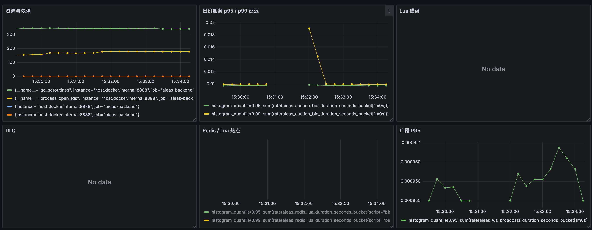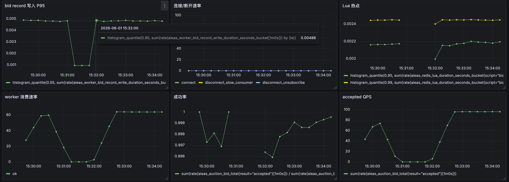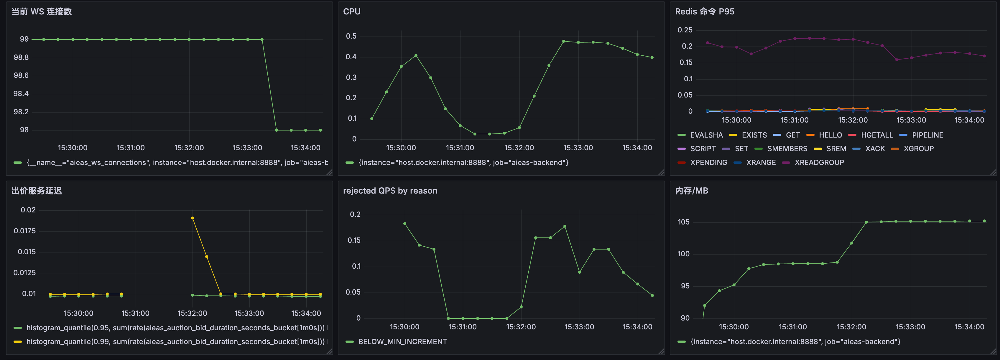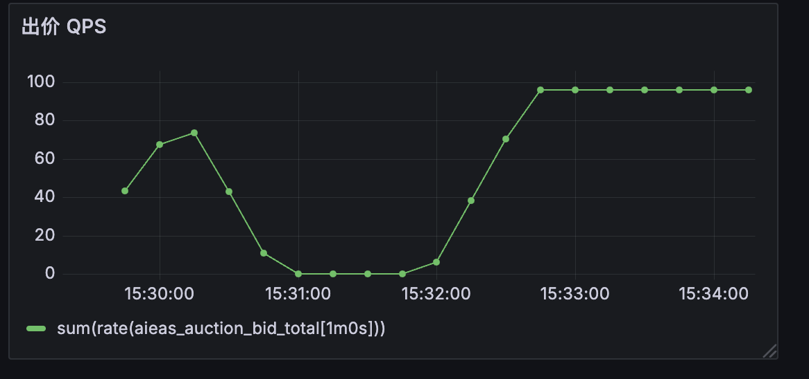
## 7. 第四阶段：大量 `BELOW_MIN_INCREMENT`

继续加压后，我看到一个明显问题：出价 QPS 很高，但大部分请求都被拒绝，原因是：

```text
BELOW_MIN_INCREMENT
```

一开始我以为只是压测工具出价太低。后来我进一步拆开看，问题分成两类。

### 7.1 压测模型问题

真实拍卖里，同一时刻只有一个出价能推进当前价，其他并发用户如果基于旧价格出价，很容易被拒绝。

举例：

```text
当前价 10000，最小加价 100
500 个用户几乎同时认为下一口价是 10100
Lua 先接受其中一个，当前价变成 10100
剩下 499 个还在出 10100，就会被拒绝 BELOW_MIN_INCREMENT
```

所以“成功 QPS”不可能等于“发送 QPS”。如果压测工具模拟的是所有用户抢同一个拍品，那么成功出价天然会被拍卖规则串行化。

这时我把压测模型拆成两种：

- 拒绝压力模式：大量 stale 出价，用来压拒绝链路、ACK、Lua 校验、拒绝统计。
- 成功出价模式：尽量让压测工具基于最新当前价生成下一口价，用来压成功链路、广播、落库、排名、延时逻辑。

### 7.2 后端拒绝链路成本过高

即使拒绝是业务上合理的，拒绝路径也不能太重。

我看到后端有慢 SQL：

```sql
INSERT INTO bid_record (...) VALUES (..., 'REJECT', 'BELOW_MIN_INCREMENT', ...)
```

这说明大量被拒绝的出价也在写 MySQL。高 QPS 下，这会把 MySQL 和异步 worker 拖进去，导致拒绝请求消耗大量资源。

我的判断是：拒绝事件不应该和成功事件一样重。

我做了几条优化：

1. `bid.rejected` 不再广播全房间，只给出价者 ACK。
2. 拒绝的出价记录不落 MySQL。
3. 拒绝事件不再写 Redis Stream / Kafka。
4. 后端只记录低成本指标，如 reject counter 和 reason。
5. 成功出价才进入可靠事件链路。

这样拒绝路径变成：

```text
客户端出价
  -> Go 基础校验
  -> Redis Lua 裁决
  -> 拒绝结果直接 ACK 给本人
  -> 指标计数
  -> 结束
```

成功路径才是：

```text
客户端出价
  -> Go 基础校验
  -> Redis Lua 裁决
  -> 更新 Redis state / ranking
  -> 写 Stream / Publish
  -> WebSocket 广播
  -> Worker/Kafka/MySQL 异步落库
```

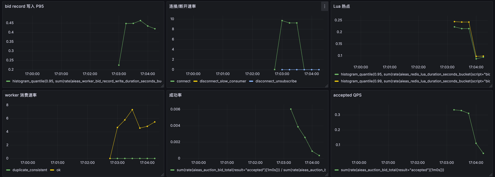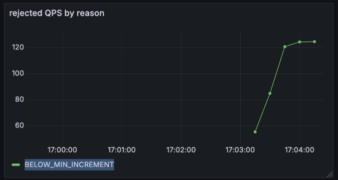

## 8. 第五阶段：MySQL 从出价热路径移除

在高 QPS 下，我又看到后端慢 SQL：

```sql
SELECT * FROM auction_lot
WHERE auction_id = ?
ORDER BY auction_lot.auction_id
LIMIT 1
```

以及：

```sql
SELECT * FROM bid_record
WHERE auction_id = ?
  AND risk_result = 'ALLOW'
  AND reject_reason = ''
ORDER BY bid_price DESC, bid_ts_ms ASC
LIMIT 1
```

我的判断是：这些查询不应该出现在实时出价热路径里。

出价链路里真正需要的实时信息应该来自 Redis：

- 当前价
- 当前领先者
- 版本号
- 拍卖状态
- 起拍价
- 封顶价
- 加价规则
- 直播场次 ID

MySQL 应该负责：

- 历史查询
- 最终事实
- 管理后台列表
- 出价记录审计
- 订单和保证金账本

所以我把出价链路中每次查 MySQL 的地方改成：

- 优先从 Redis state 取。
- 拍品静态信息用本地短 TTL 缓存。
- 历史查询路径补充索引。
- 后台统计尽量不要在高频路径上查 `bid_record` 排序。

同时我给 `bid_record` 增加了适合历史查询的索引，避免历史接口继续拖慢 MySQL：

```sql
auction_id, risk_result, reject_reason, bid_price DESC, bid_ts_ms ASC
auction_id, risk_result, reject_reason, bid_ts_ms
```


## 9. 第六阶段：500 QPS 与并发窗口

当我把目标 QPS 提到 500 时，压测工具里显示：

- 目标 QPS：500
- 实时发送 QPS：约 437-460
- 实时成交 QPS：约 120
- 本地/后端在线：500/500
- ACK P95：几十毫秒以内

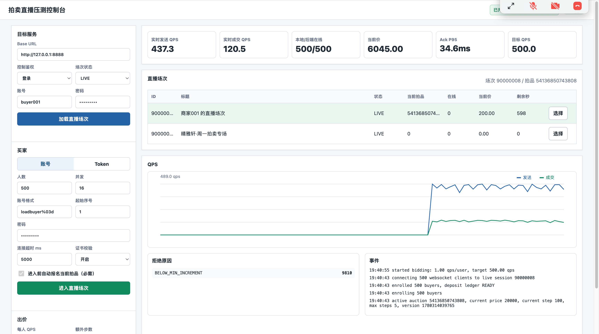

一开始我问自己：实际后端出价 QPS 只能到 460 左右，是不是就是瓶颈？

我的结论是：不能只看这个数字就说是后端瓶颈，要先分清楚是“客户端没发出来”，还是“后端没吃进去”。

这里有两个关键指标：

- 压测工具实时发送 QPS。
- 后端 Grafana `aieas_auction_bid_total` 的 QPS。

如果两者一致，说明压测工具发多少，后端就收到多少。此时 460 不是后端丢请求，而是压测工具当前参数下只能稳定发到 460。

如果压测工具显示 500，但后端只有 460，才需要怀疑网络、WebSocket 写阻塞、后端入口阻塞或连接问题。

### 9.1 并发窗口的含义

我后来把并发窗口调到 64。这里的“并发窗口”本质上是压测工具允许同时在飞的请求/消息数量。

它会影响 QPS：

```text
理论吞吐 ≈ 并发窗口 / 平均 ACK 延迟
```

如果 ACK 延迟是 50ms，并发窗口是 16，那么理论上单个调度器最多支撑：

```text
16 / 0.05 = 320 QPS
```

如果提高并发窗口到 64，就能缓解客户端侧等待 ACK 导致的发不满。

但并发窗口不是越大越好。窗口过大时，如果后端已经开始排队，压测工具会继续堆积请求，看到的延迟会更高，也更难判断真实瓶颈。

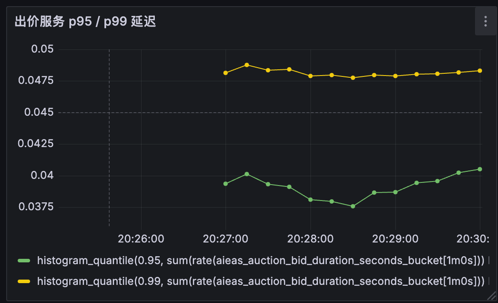

## 10. 第七阶段：1000 QPS 后延迟突然升高

我把目标 QPS 拉到 1000 后，看到一个更典型的问题：

- 开始时 ACK P95 约 12ms。
- 跑一段时间后，ACK P95 升到 90ms 左右。
- 实时发送 QPS 和后端监控 QPS 基本一致。
- 成交 QPS 下降，大量请求变成 `BELOW_MIN_INCREMENT`。

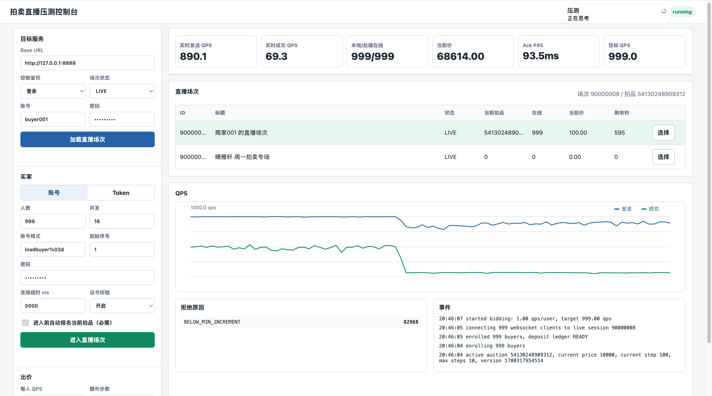

这时我判断：问题不是压测工具发不出来，而是后端链路跑一段时间后有某些状态在累积，导致延迟上升。

为了定位，我不能再只看总耗时，而是要把出价链路拆成阶段打点。

## 11. 第八阶段：增加阶段打点

我给出价链路加了阶段指标：

```text
aieas_auction_bid_stage_duration_seconds{stage,result}
```

它的单位是秒。比如：

```text
0.023 = 23ms
0.009 = 9ms
0.001 = 1ms
```

我关注的阶段包括：

| stage | 含义 |
|---|---|
| `input_validate` | Go 层基础参数校验 |
| `auction_snapshot_source` | 拍品/拍卖静态快照来源，可能是 cache hit 或 db |
| `auction_snapshot` | 组装拍卖快照 |
| `redis_state` | 从 Redis 读取当前实时拍卖状态 |
| `fast_stale_reject` | Go 层基于明显过期价格的快速拒绝 |
| `validate_expected_state` | 校验客户端传来的 `expectedCurrentPrice` 与当前状态是否匹配 |
| `increment_rule` | 根据加价规则计算/校验下一口价 |
| `blacklist_strategy` | 判断黑名单策略是否启用 |
| `blacklist_lookup` | 查询用户是否命中黑名单 |
| `bidder_nickname` | 获取出价人昵称，用于事件展示 |
| `realtime_place_bid` | 调用 Redis Lua 完成原子裁决 |
| `enrich_result` | 补充成功结果返回字段 |
| `enrich_reject_result` | 补充拒绝结果返回字段 |
| `live_agent_hook` | 触发直播 Agent hook |

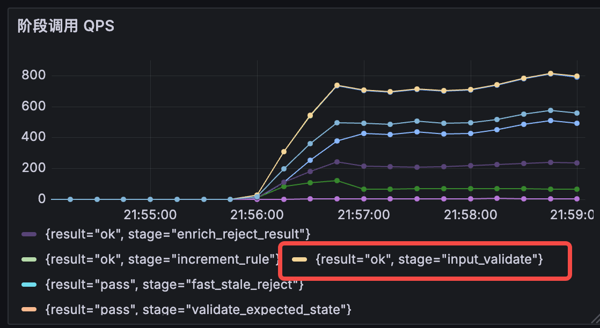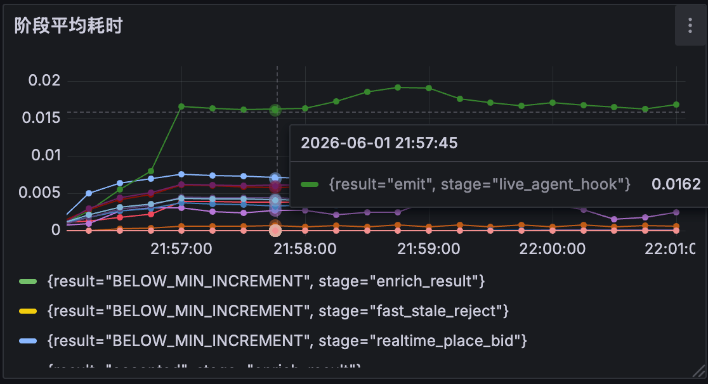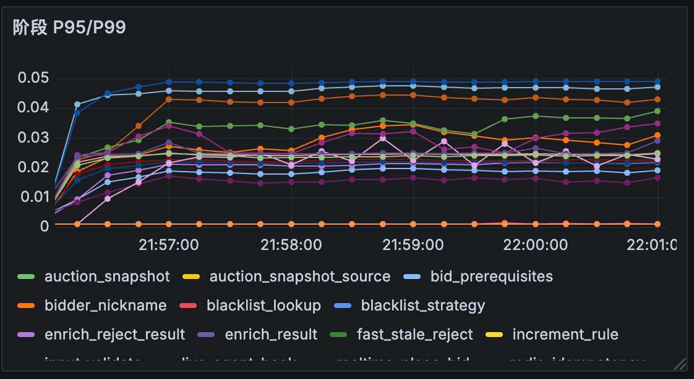
从阶段图里，我发现：

- `input_validate` QPS 最高，因为所有请求都会经过。
- `live_agent_hook` 平均耗时较高。
- `realtime_place_bid` 是核心同步路径。
- `bidder_nickname` 曾经出现在 P95 前列，说明昵称查询不应该每次都同步查。
- `auction_snapshot_source=db` 如果出现，说明还有 MySQL 查询进入了链路。

## 12. 第九阶段：Redis 与 Lua 分析

阶段打点显示 `realtime_place_bid` 和 Redis Lua 延迟接近。于是我进一步看 Redis。

我在 Redis 里查看过：

```bash
redis-cli INFO commandstats | grep -i eval
redis-cli SLOWLOG GET 10
redis-cli INFO stats | grep instantaneous_ops_per_sec
redis-cli INFO cpu
```

当时看到一个现象：

- Grafana 上 Redis EVALSHA P95 可能是 20ms 以上。
- Redis `cmdstat_evalsha usec_per_call` 却只有几十到一百多微秒。
- Redis SLOWLOG 里偶尔有 `evalsha`、`ZREM`、`XRANGE`。
- `XREADGROUP` P95 很高，但 XPENDING 是 0，lag 也是 0。

我的判断是：

1. `XREADGROUP` 高不一定代表同步出价慢，它可能包含 BLOCK 等待时间。
2. Grafana 的 Redis 命令耗时是客户端视角，包含连接池等待、网络、Redis 单线程排队、命令执行。
3. Redis server 的 `usec_per_call` 是命令实际执行平均耗时，不能完全代表客户端感知延迟。
4. 如果重启 Redis 后所有阶段延迟下降，说明 Redis 里累积的数据规模、key 数量、stream/zset/hash 大小会影响后续表现。

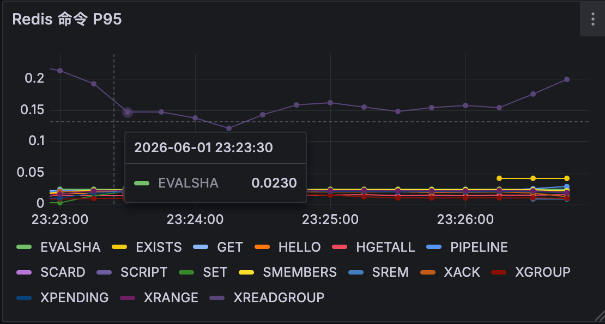

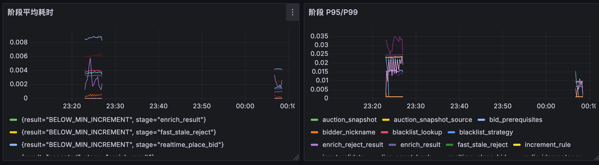

## 13. 第十阶段：幂等 TTL 优化

我发现出价幂等 key 一开始使用了很长 TTL，比如 24 小时。压测环境下 requestId 很多，这会造成大量：

```text
auction:{auctionId}:idem:{requestId}
```

这些 key 堆在 Redis 里，对内存、扫描、过期、哈希表扩容都有影响。

业务上，WebSocket 出价的 requestId 幂等不需要保存 24 小时。它主要是为了处理短时间内的重试和重复发送。于是我把出价幂等 TTL 改成可配置，默认 30 秒：

```yaml
auction:
  bidIdempotencyTTL: 30s
```

我的判断是：

- HTTP 状态变更接口的幂等可以保留更长。
- WebSocket 出价幂等只需要覆盖短时间重试。
- 30 秒对压测和真实用户重试都更合理。
- 如果业务以后需要更强审计，应该依赖成功事件和 MySQL 出价记录，而不是 Redis 幂等 key 长期保存。

同时，我把 Lua 中重复 requestId 的返回结果补上 `duplicate=true`，这样压测和指标可以区分新请求和幂等重复。

## 14. 第十一阶段：减少 Lua 前的 Redis 往返

在阶段图里，我看到优化前还有这些阶段：

- `redis_idempotency`
- `bid_prerequisites`

这说明 Go 在调用 Lua 前，还单独做了 Redis GET 或 Pipeline 查询。

我重新审视后认为：这些逻辑本来就应该由 Lua 一次性原子完成。

原因是：

- 出价幂等必须和裁决在同一个原子上下文里。
- 报名和保证金状态必须和裁决在同一个原子上下文里。
- Go 先查一遍 Redis，Lua 再查一遍，只会增加 RTT。
- Go 预查和 Lua 裁决之间仍然可能发生状态变化。

所以我移除了 Lua 前的独立 Redis 幂等 GET 和报名/保证金 Pipeline，把最终判断收敛到 Lua 内。

优化后的链路变成：

```text
Go 参数校验
  -> Redis state / 本地快照用于快速判断
  -> Redis Lua 一次性裁决
  -> 根据 Lua result 做 ACK / 广播 / 异步事件
```

同时我保留了必要的业务行为：如果 Lua 返回 `NOT_ENROLLED` 或 `DEPOSIT_NOT_READY`，后续仍然可以触发对应的风控/黑名单逻辑，只是这个逻辑不再阻塞 Lua 前置校验。
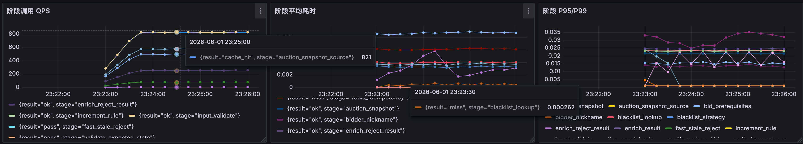

## 15. 第十二阶段：Lua 热路径清理

我还检查了 Lua 热路径里的调试型 `TYPE` 检查。

这类检查在开发阶段有价值，可以帮助发现 key 类型污染；但在高频出价路径里，每次执行都会多消耗 Redis 命令和 Lua 时间。

我的判断是：

- key 类型约束应该靠 key 命名、初始化逻辑、测试和 readyz 检查保障。
- 热路径里不应该每次做调试型 `TYPE`。
- 如果担心线上 key 污染，可以做低频巡检或管理命令，不应该放在每次出价里。

所以我把 Lua 热路径中的 `TYPE` 检查移掉，并用测试保证脚本里不再出现这类调用。

## 16. 第十三阶段：异步落库与 Worker 优化

成功出价仍然需要落库，但落库不应该阻塞用户 ACK。

我把原则定为：

```text
实时 ACK 看 Redis Lua 裁决结果
历史记录靠 Stream/Kafka/MySQL 异步落库
```

对 `bid_record` worker，我做了这些优化方向：

- 拒绝记录不落库。
- 成功记录异步写。
- 写入使用 `INSERT IGNORE` 或等价的幂等插入。
- 后续可以进一步做批量写。
- 通过 Worker 消费速率、写入 P95、DLQ、pending/lag 来判断是否积压。

我在 Redis Stream 上确认过：

```bash
redis-cli XINFO GROUPS auction:<auction_id>:stream
redis-cli XPENDING auction:<auction_id>:stream aieas-bid-kafka-bridge
```

当 pending 为 0、lag 为 0 时，说明 Stream consumer 没有明显积压。此时如果 ACK 仍然升高，就不能把问题简单归因到 Worker。

```bash
/data # redis-cli XPENDING auction:54521187402240:stream aieas-bid-kafka-bridge
1) (integer) 0
2) (nil)
3) (nil)
4) (nil)
```

## 17. 当前优化后的指标判断

当前最新阶段图里，我看到：

- `bid_prerequisites` 已经消失，说明 Lua 前报名/保证金 Pipeline 已移除。
- `realtime_place_bid` 接受路径大约在 7ms 左右。
- `BELOW_MIN_INCREMENT` 的 `realtime_place_bid` 大约在 8-9ms。
- `auction_snapshot_source=cache_hit` 和 `bidder_nickname` 基本在 1ms 左右。
- `redis_state hit` 仍然在几个毫秒到 9ms 左右。
- `live_agent_hook emit` 也会贡献几毫秒。
- `increment_rule` 偶尔有波动，需要继续观察是计算问题、状态等待，还是指标聚合上的尖刺。

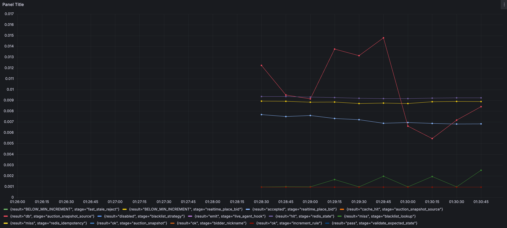

如果我在最新图里还看到 `redis_idempotency`，我会先判断是不是以下原因：

1. 后端没有完全重启。
2. 还有旧实例在跑。
3. Grafana 时间范围包含旧样本。
4. Prometheus 旧 series 还在显示历史数据。

我会用下面的 PromQL 验证它是否还在产生新数据：

```promql
sum(rate(aieas_auction_bid_stage_duration_seconds_count{stage="redis_idempotency"}[1m]))
```

如果结果大于 0，说明仍有旧代码路径在跑。  
如果结果等于 0，只是历史曲线残留。

## 18. 我对当前瓶颈的判断

到目前为止，我不会简单说“后端出价链路已经没有瓶颈”。更准确的判断是：

1. 最早的问题不是纯性能，而是压测流程和接口不匹配。
2. 后端曾经存在 WebSocket 连接生命周期问题，导致异常关闭和 panic。
3. 在线人数曾经被 Redis 长 TTL 状态污染，后来改成短 TTL + heartbeat + userID 去重。
4. 拒绝路径曾经过重，拒绝也广播、写 Stream、写 MySQL，这是高 QPS 下的主要浪费。
5. MySQL 曾经进入实时出价热路径，这是必须移除的。
6. Redis Lua 是当前实时裁决核心，它的客户端感知延迟仍然决定 ACK 下限。
7. Redis key/stream/zset/hash 累积会让长时间压测后的延迟变差。
8. 成功出价 QPS 和发送 QPS不能直接等同，因为同一拍品的成功推进天然是串行竞争。

所以我现在更关注这些问题：

- Redis state 读取是否还能减少一次 RTT。
- 成功出价时 Lua 内排名更新是否还能瘦身。
- Stream 是否需要 `XTRIM` 控制长度。
- WebSocket 广播是否会在更高在线人数下放大。
- live agent hook 是否应该彻底异步化或按开关关闭。
- go-redis 连接池是否存在 wait。
- 单 Redis 分片是否已经接近单线程队列上限。

## 19. 后续压测计划

我后续会按以下顺序继续压：

### 19.1 固定模型复测

固定这些参数：

- 同一个拍品。
- 同样人数。
- 同样并发窗口。
- 同样目标 QPS。
- 同样出价模式。
- 每次压测前清理或记录 Redis key 数量和 stream 长度。

避免每次变量太多，导致结论不稳定。

### 19.2 分模式压测

我会分三种模式：

| 模式 | 目的 |
|---|---|
| 拒绝压力模式 | 压 Go 校验、Lua 拒绝、ACK、拒绝统计 |
| 成功出价模式 | 压 Lua 成功裁决、广播、Stream、Worker、MySQL |
| 混合模式 | 模拟真实直播间里大量跟价失败 + 少量成功推进 |

### 19.3 阶梯加压

我会按下面方式加压：

```text
100 QPS -> 300 QPS -> 500 QPS -> 800 QPS -> 1000 QPS -> 1500 QPS
```

每一档至少跑 5-10 分钟，而不是只看启动后的瞬时指标。

每一档记录：

- 发送 QPS
- 后端接收 QPS
- accepted QPS
- rejected QPS by reason
- ACK P50/P95/P99
- 出价服务 P95/P99
- Redis EVALSHA P95/P99
- Lua bid.place P95/P99
- Redis command P95 by op
- Worker 消费速率
- Worker 写入 P95
- Stream pending/lag
- CPU/内存/FD/goroutine
- WebSocket 连接数和断开原因

### 19.4 Redis 累积数据监控

每轮压测前后我会记录：

```bash
redis-cli INFO memory
redis-cli DBSIZE
redis-cli XLEN auction:<auction_id>:stream
redis-cli ZCARD auction:<auction_id>:bids
redis-cli HLEN auction:<auction_id>:user_bids
redis-cli --scan --pattern 'auction:<auction_id>:idem:*' | wc -l
```

如果压测时间越长延迟越高，而重启 Redis 或清理 key 后明显恢复，那就说明需要做数据生命周期治理，例如：

- 出价 stream 做 `XTRIM`。
- 幂等 key 短 TTL。
- 历史排名/用户出价数据定期清理。
- 结束拍卖后归档/删除实时 key。

## 20. 当前已落地的优化清单

我这轮已经落地或验证过的优化包括：

- 压测工具完整模拟买家行为。
- 压测前自动报名，保证 `deposit_ledger=READY`。
- 压测工具读取后端 `incrementRule`，不再本地乱生成加价规则。
- UI 去掉业务不存在的“加价分”。
- `bid.place` 使用后端要求的 WebSocket 消息格式。
- 在线人数改成短 TTL + heartbeat 刷新。
- 在线人数按 userID 去重。
- 修复/规避高并发 WebSocket 读写关闭导致的后端 panic。
- `bid.rejected` 不再广播全房间，只 ACK 出价者。
- 拒绝出价不再写 Stream/Kafka/MySQL。
- 出价热路径不再每次查 MySQL `auction_lot`。
- 出价热路径尽量从 Redis state 或本地短 TTL 缓存取拍品信息。
- `bid_record` 历史查询补索引。
- `bid_record` worker 使用幂等写入思路。
- 增加出价阶段耗时打点。
- 出价幂等 TTL 改为可配置，默认 30 秒。
- 移除 Lua 前独立 Redis 幂等 GET。
- 移除 Lua 前报名/保证金 Pipeline。
- Lua 内重复 requestId 返回 `duplicate=true`。
- 移除 Lua 热路径调试型 `TYPE` 检查。
- 昵称查询和 Agent hook 不再成为核心裁决前置瓶颈。

## 21. 最终总结

这次压测给我的最大结论是：实时拍卖系统的瓶颈不是一个点，而是一条链。

如果只看总 QPS，我很容易误判；如果只看 ACK 延迟，我也不知道是 Redis、MySQL、Worker 还是 WebSocket。真正有效的方式是把链路拆开：

```text
客户端发送
  -> 后端入口
  -> Go 预校验
  -> Redis state
  -> Lua 裁决
  -> ACK
  -> 广播
  -> Stream/Kafka
  -> Worker
  -> MySQL
```

然后逐段判断：

- 哪些阶段在同步路径。
- 哪些阶段可以异步。
- 哪些阶段可以缓存。
- 哪些阶段应该只做成功事件。
- 哪些阶段只是观测/历史查询，不应该拖慢实时出价。

当前系统已经从“流程能跑但高压下拒绝链路过重、MySQL 和 Redis 状态累积影响明显”，优化到了“核心裁决基本收敛到 Redis Lua，拒绝路径变轻，阶段指标能定位问题”的状态。

下一步我会继续围绕 Redis 同步 RTT、Lua 内数据结构复杂度、Stream 生命周期、连接池等待和广播放大效应做压测，而不是盲目拆微服务。只有当单体多实例 + Redis 原子裁决这条链路的边界被测清楚以后，再讨论是否拆服务、拆哪些服务、怎么通过 MQ/RPC 解耦，才是比较稳的。
