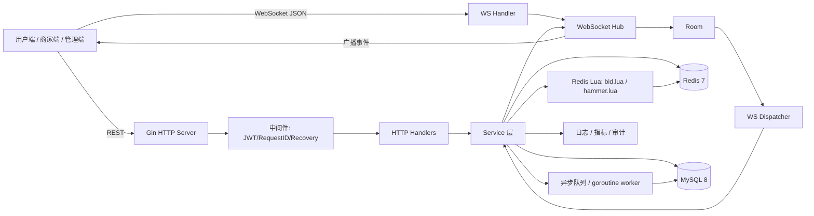
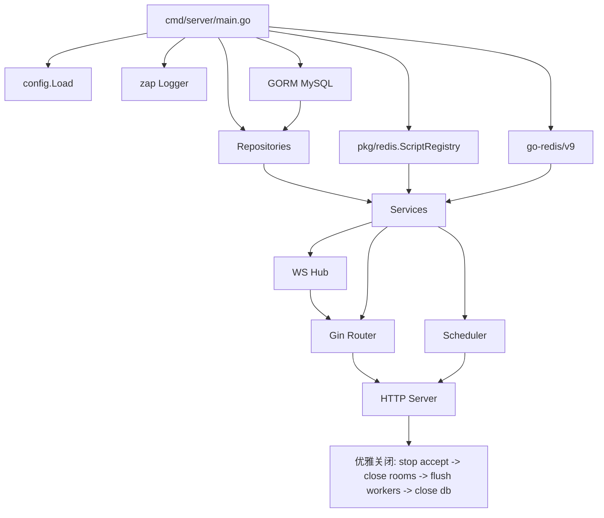
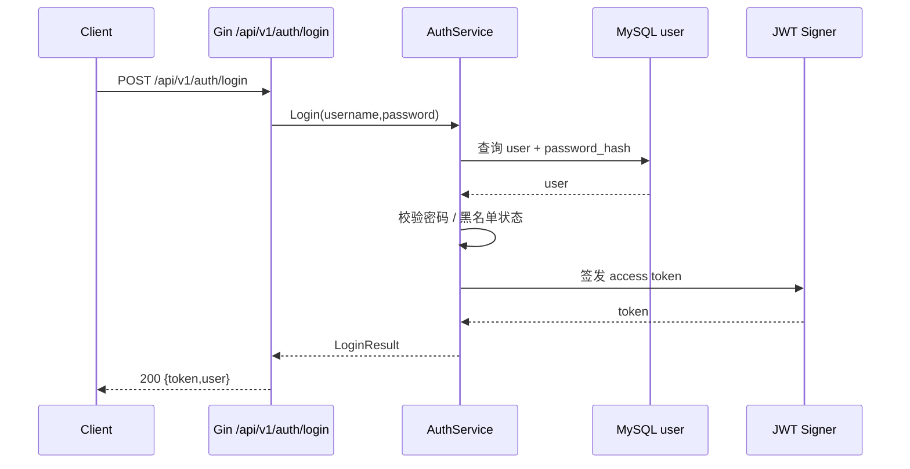
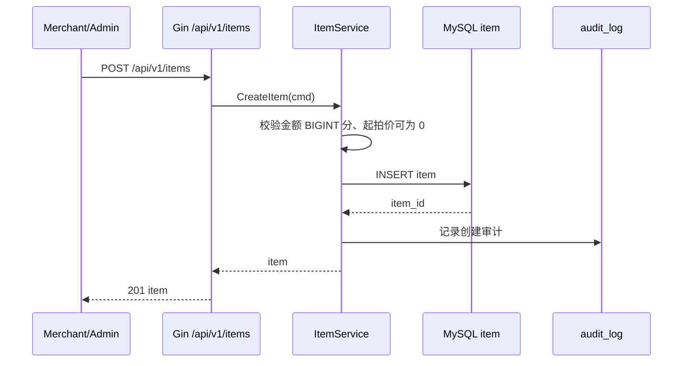
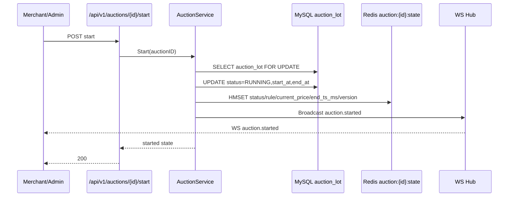
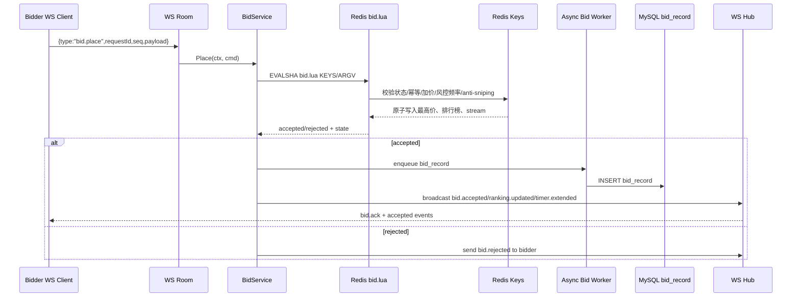
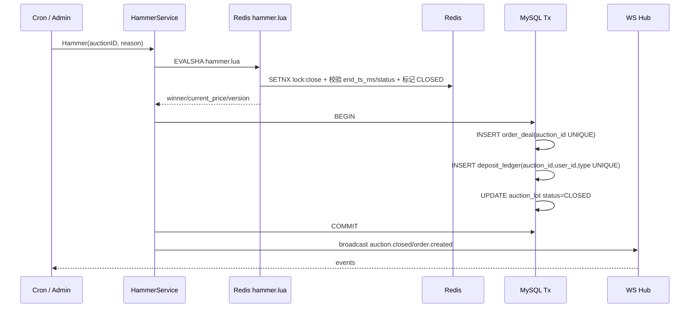
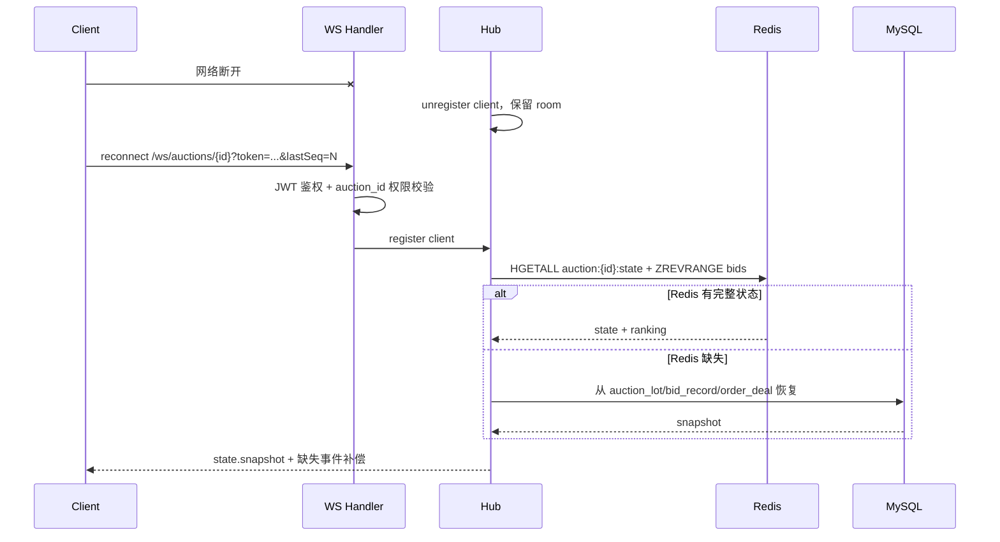

# 实时竞拍大师后端详细技术设计

> 技术基线：Go 1.22 + Gin + 原生 WebSocket（优先 `nhooyr.io/websocket`，可替换为 `gorilla/websocket`）+ GORM + go-redis/v9 + MySQL 8 + Redis 7。本文仅描述 Go 后端服务设计，所有金额使用 `BIGINT`，单位为分，起拍价允许为 0。

## 1. 文档定位与范围

### 1.1 文档定位

本文面向「实时竞拍大师」直播竞拍系统后端研发、联调、测试与运维，给出可落地的 Go 后端详细技术设计，覆盖：

- HTTP REST API 与 WebSocket 实时竞拍通道。
- 拍品、拍卖场次、报名保证金、实时出价、落锤成交、订单生成、风控事件、审计日志等核心域模型。
- Redis 热路径、Lua 原子脚本、MySQL 事实表、异步落库、广播 Hub、倒计时调度、断线重连恢复。
- 部署、配置、可观测性、容错与性能目标。

### 1.2 范围边界

后端需要对齐以下业务事实：

- 单房间在线人数：`1k ~ 5k`。
- 单房间出价 QPS：`100 ~ 500`。
- 出价链路 P99：`< 300ms`。
- 落锤成交：`100% 唯一`，禁止重复成交、重复扣保证金、重复生成订单。
- Redis 是竞拍热路径权威缓存，MySQL 是最终事实表。
- WebSocket 使用 JSON 信封：`{type,payload,requestId,seq}`。

本文不覆盖：

- 前端页面实现。
- AI 模型训练与推理实现细节，仅定义后端调用边界。
- 支付通道清结算细节，仅设计订单与保证金流水。
- 大数据离线分析链路。

## 2. 技术栈与选型理由

| 层级 | 推荐选型 | 备选 | 禁止 / 不采用 | 选型理由 |
| --- | --- | --- | --- | --- |
| Go 版本 | Go 1.22 | Go 1.21+ | 低于 Go 1.20 | Go 1.22 标准库、性能和工具链稳定，适合高并发网络服务。 |
| HTTP 框架 | Gin | Echo / Fiber / chi | Hertz / go-zero / kitex | Gin 生态成熟、团队学习成本低、中间件丰富；Echo/Fiber/chi 可作为开源替代；本文系统不采用禁止项。 |
| WebSocket | 原生 WebSocket：`nhooyr.io/websocket` | `github.com/gorilla/websocket` | 封装型 RPC 网关 | 直接控制连接、心跳、背压、房间广播和断线重连语义，便于极致优化。 |
| ORM | GORM | sqlc / sqlx | 自研 ORM | GORM 对 MySQL 8 支持成熟，迁移、事务、模型声明与团队使用成本均衡。 |
| 缓存 / 原子脚本 | Redis 7 + go-redis/v9 + Lua | Redis Cluster / Sentinel | 仅依赖数据库锁 | 出价与落锤要求低延迟、强原子，Redis Lua 适合处理热路径状态机。 |
| 数据库 | MySQL 8 | TiDB / PostgreSQL | 文件型数据库 | MySQL 8 支持事务、唯一约束、索引和成熟运维体系，作为事实表可靠。 |
| 日志 | zap | zerolog | fmt 打印日志 | 结构化、高性能、便于采集。 |
| 指标 | prometheus client_golang | OpenTelemetry Metrics | 无指标运行 | 需要 P99、QPS、连接数、错误码等可观测指标。 |
| 配置 | YAML + 环境变量覆盖 | TOML / JSON | 硬编码配置 | 便于本地、测试、生产多环境管理。 |
| 依赖注入 | main.go 手工装配 | 简单 Provider 函数 | fx / wire | 控制启动顺序，降低框架复杂度，不引入额外 DI 生成或运行时容器。 |

### 2.1 REST 路径清单

| 方法 | 路径 | 说明 |
| --- | --- | --- |
| POST | `/api/v1/auth/login` | 用户登录，签发 JWT。 |
| POST / GET | `/api/v1/items` | 拍品创建与查询。 |
| POST / GET | `/api/v1/auctions` | 拍卖场次创建与查询。 |
| POST | `/api/v1/auctions/{id}/start` | 开拍。 |
| POST | `/api/v1/auctions/{id}/hammer` | 手工落锤。 |
| POST | `/api/v1/auctions/{id}/cancel` | 取消拍卖。 |
| GET | `/api/v1/auctions/{id}/state` | 查询拍卖状态快照。 |
| POST | `/api/v1/auctions/{id}/enroll` | 报名并冻结保证金。 |
| GET | `/api/v1/auctions/mine` | 我的拍卖。 |
| GET | `/api/v1/orders` | 订单列表。 |
| GET | `/api/v1/orders/mine` | 我的订单。 |
| ANY | `/api/v1/admin/*` | 管理端接口。 |
| POST | `/api/v1/ai/start-price-suggest` | AI 起拍价建议。 |
| POST | `/api/v1/ai/announcement` | AI 讲解 / 公告生成。 |

## 3. 项目目录结构

采用 Go 标准 layout，业务代码尽量收敛在 `internal`，可复用但不泄漏业务上下文的包放在 `pkg`。

```text
realtime-auction-master/
├── cmd/
│   └── server/
│       └── main.go                    # 服务入口，手工装配依赖
├── configs/
│   ├── config.yaml                    # 默认配置
│   ├── config.local.yaml              # 本地覆盖配置
│   └── config.prod.yaml               # 生产配置示例
├── internal/
│   ├── app/
│   │   ├── server.go                  # HTTP/WS server 生命周期
│   │   └── router.go                  # Gin 路由注册
│   ├── config/
│   │   └── config.go                  # 配置加载与校验
│   ├── middleware/
│   │   ├── auth.go                    # JWT 鉴权
│   │   ├── recovery.go                # panic 恢复
│   │   └── request_id.go              # 请求 ID
│   ├── domain/
│   │   ├── model.go                   # 领域模型与状态枚举
│   │   └── errors.go                  # 业务错误码
│   ├── repository/
│   │   ├── user_repo.go
│   │   ├── item_repo.go
│   │   ├── auction_repo.go
│   │   ├── bid_repo.go
│   │   ├── order_repo.go
│   │   └── deposit_repo.go
│   ├── service/
│   │   ├── auth_service.go
│   │   ├── item_service.go
│   │   ├── auction_service.go
│   │   ├── bid_service.go
│   │   ├── hammer_service.go
│   │   ├── deposit_service.go
│   │   └── risk_service.go
│   ├── transport/
│   │   ├── http/
│   │   │   ├── auth_handler.go
│   │   │   ├── item_handler.go
│   │   │   ├── auction_handler.go
│   │   │   └── order_handler.go
│   │   └── ws/
│   │       ├── handler.go             # WS 升级与鉴权
│   │       ├── hub.go                 # Hub/Room 管理
│   │       ├── room.go                # 房间广播与 ticker
│   │       ├── client.go              # 单连接读写泵
│   │       ├── message.go             # WS 信封协议
│   │       └── dispatcher.go          # type 到 handler 分发
│   ├── scheduler/
│   │   ├── cron.go                    # 落锤兜底 cron
│   │   └── recovery.go                # 进程重启恢复
│   └── observability/
│       ├── logger.go
│       ├── metrics.go
│       └── health.go
├── pkg/
│   ├── redis/
│   │   ├── client.go
│   │   └── script.go                  # SCRIPT LOAD / EVALSHA / NOSCRIPT
│   ├── jwt/
│   │   └── jwt.go
│   ├── idgen/
│   │   └── snowflake.go
│   └── timeutil/
│       └── clock.go
├── scripts/
│   └── lua/
│       ├── bid.lua                    # 出价原子脚本
│       └── hammer.lua                 # 落锤原子脚本
├── migrations/
│   ├── 001_init_schema.sql
│   ├── 002_add_indexes.sql
│   └── 003_seed_config.sql
├── deployments/
│   ├── Dockerfile
│   └── docker-compose.yaml
├── Makefile
├── go.mod
└── go.sum
```

## 4. 整体架构

### 4.1 整体调用关系



### 4.2 进程内装配关系



## 5. 关键流程时序图

### 5.1 登录流程



### 5.2 拍品创建流程



### 5.3 开拍流程



### 5.4 出价流程



### 5.5 落锤流程



### 5.6 断线重连流程



## 6. WebSocket Hub 详细设计

### 6.1 协议

客户端与服务端均使用统一 JSON 信封：

```json
{
  "type": "bid.place",
  "payload": {},
  "requestId": "01HY...",
  "seq": 1024
}
```

事件类型包括：

- 客户端上行：`bid.place`。
- 服务端应答 / 广播：`bid.ack`、`bid.accepted`、`bid.rejected`、`ranking.updated`、`bidder.overtaken`、`timer.tick`、`timer.extended`、`auction.started`、`auction.closed`、`order.created`、`announcement`、`risk.event`、`error`。

### 6.2 核心结构体

```go
package ws

import (
    "context"
    "sync"
    "time"

    "nhooyr.io/websocket"
)

type Envelope struct {
    Type      string `json:"type"`
    Payload   any    `json:"payload,omitempty"`
    RequestID string `json:"requestId,omitempty"`
    Seq       int64  `json:"seq,omitempty"`
}

type Hub struct {
    mu     sync.RWMutex
    rooms  map[int64]*Room
    deps   Dependencies
    closed chan struct{}
}

type Room struct {
    AuctionID int64

    mu       sync.RWMutex
    clients  map[string]*Client
    register chan *Client
    leave    chan *Client
    inbound  chan ClientMessage
    outbound chan Envelope

    tickerStop chan struct{}
    lastActive time.Time
    deps       Dependencies
}

type Client struct {
    ID        string
    UserID    int64
    AuctionID int64
    Conn      *websocket.Conn

    send       chan Envelope
    lastSeq    int64
    connectedAt time.Time
}

type ClientMessage struct {
    Client *Client
    Msg    Envelope
}
```

### 6.3 goroutine 模型

- `Hub`：管理 `auction_id -> Room` 映射，只负责创建、查找、关闭房间。
- 每个 `Room`：一个主循环 goroutine，串行处理注册、离开、广播、上行消息分发，避免房间内共享状态被多处并发修改。
- 每个 `Client`：两个 goroutine。
  - `readPump`：读取 WebSocket 消息，校验大小、反序列化、写入 `Room.inbound`。
  - `writePump`：从 `Client.send` 读取事件写回连接，负责 ping/pong、写超时和背压断开。
- `BidService`、`HammerService` 不直接写连接，只调用 `Hub.Broadcast` 或 `Hub.SendToUser`。

### 6.4 房间生命周期

1. 首个客户端进入或开拍时创建 Room。
2. Room 启动后从 Redis 加载 `auction:{id}:state`，启动倒计时 ticker。
3. 最后一个客户端离开后不立即销毁，保留短 TTL，例如 60 秒，支持快速重连。
4. 拍卖关闭且无在线用户时销毁 Room。
5. 进程关闭时先停止接受新连接，再关闭所有 Room，最后等待 worker flush。

### 6.5 心跳与背压

- 服务端每 `20s` 发送 ping，`60s` 未收到 pong 则断开。
- 单客户端 `send` channel 建议 buffer `128 ~ 512`。
- 如果 `send` 满，说明客户端消费慢，Room 关闭该连接并发送审计事件。
- 大广播采用每个客户端非阻塞投递，慢客户端不拖垮房间。

### 6.6 JWT 鉴权

WebSocket 连接格式：

```text
GET /ws/auctions/{auction_id}?token=<jwt>&lastSeq=<seq>
```

鉴权步骤：

1. 校验 JWT 签名、过期时间、用户状态。
2. 校验用户不在 `risk:blacklist:user`。
3. 校验用户对该拍卖有可见权限；出价时还要校验已报名、保证金已冻结。
4. 记录 `online:auction:{id}`，用于在线人数指标与断线恢复。

### 6.7 并发安全代码片段

```go
func (h *Hub) GetOrCreateRoom(auctionID int64) *Room {
    h.mu.RLock()
    room := h.rooms[auctionID]
    h.mu.RUnlock()
    if room != nil {
        return room
    }

    h.mu.Lock()
    defer h.mu.Unlock()
    if room = h.rooms[auctionID]; room != nil {
        return room
    }
    room = NewRoom(auctionID, h.deps)
    h.rooms[auctionID] = room
    go room.Run()
    return room
}

func (r *Room) broadcast(msg Envelope) {
    r.mu.RLock()
    defer r.mu.RUnlock()
    for _, c := range r.clients {
        select {
        case c.send <- msg:
        default:
            go c.Close(websocket.StatusPolicyViolation, "slow consumer")
        }
    }
}
```

## 7. Redis Lua 脚本调用细节

### 7.1 Redis Key 清单

| Key | 类型 | 说明 |
| --- | --- | --- |
| `auction:{id}:state` | Hash | 拍卖热状态：status、current_price、winner_id、end_ts_ms、version 等。 |
| `auction:{id}:bids` | ZSet | 出价排名，score 可用金额或复合分。 |
| `auction:{id}:user_bids` | Hash | 用户最高出价。 |
| `auction:{id}:idem:{request_id}` | String | 出价请求幂等结果，短 TTL。 |
| `auction:{id}:lock:close` | String | 落锤关闭锁，保证唯一关闭。 |
| `auction:{id}:stream` | Stream | 竞拍事件流，用于补偿和恢复。 |
| `online:auction:{id}` | Set | 在线用户 / 连接标识。 |
| `risk:freq:bid:{user_id}:{auction_id}` | String | 出价频率限制计数。 |
| `risk:blacklist:user` | Set | 黑名单用户。 |

### 7.2 SCRIPT LOAD、EVALSHA、NOSCRIPT 回退

`pkg/redis/script.go`：

```go
package redisx

import (
    "context"
    "errors"
    "strings"
    "sync"

    "github.com/redis/go-redis/v9"
)

type Script struct {
    Name string
    Body string
    sha  string
}

type ScriptRegistry struct {
    client *redis.Client
    mu     sync.RWMutex
    items  map[string]*Script
}

func NewScriptRegistry(client *redis.Client, scripts map[string]string) *ScriptRegistry {
    items := make(map[string]*Script, len(scripts))
    for name, body := range scripts {
        items[name] = &Script{Name: name, Body: body}
    }
    return &ScriptRegistry{client: client, items: items}
}

func (r *ScriptRegistry) LoadAll(ctx context.Context) error {
    for _, s := range r.items {
        sha, err := r.client.ScriptLoad(ctx, s.Body).Result()
        if err != nil {
            return err
        }
        r.mu.Lock()
        s.sha = sha
        r.mu.Unlock()
    }
    return nil
}

func (r *ScriptRegistry) Eval(ctx context.Context, name string, keys []string, args ...any) *redis.Cmd {
    r.mu.RLock()
    s := r.items[name]
    sha := ""
    if s != nil {
        sha = s.sha
    }
    r.mu.RUnlock()
    if s == nil {
        return redis.NewCmd(ctx, redis.Nil)
    }

    cmd := r.client.EvalSha(ctx, sha, keys, args...)
    if err := cmd.Err(); err == nil || !isNoScript(err) {
        return cmd
    }

    reloadSha, err := r.client.ScriptLoad(ctx, s.Body).Result()
    if err != nil {
        return redis.NewCmdResult(nil, err)
    }
    r.mu.Lock()
    s.sha = reloadSha
    r.mu.Unlock()
    return r.client.EvalSha(ctx, reloadSha, keys, args...)
}

func isNoScript(err error) bool {
    return err != nil && (errors.Is(err, redis.Nil) || strings.Contains(err.Error(), "NOSCRIPT"))
}
```

### 7.3 `bid.lua` KEYS / ARGV 映射

Go 入参结构：

```go
type BidScriptInput struct {
    AuctionID       int64
    UserID          int64
    RequestID       string
    AmountCent      int64
    NowMs           int64
    MinIncrement    int64
    AntiSnipeMs     int64
    ExtendMs        int64
    IdemTTLSeconds  int64
    FreqLimitCount  int64
    FreqWindowMs    int64
}

func (in BidScriptInput) Keys() []string {
    id := strconv.FormatInt(in.AuctionID, 10)
    uid := strconv.FormatInt(in.UserID, 10)
    return []string{
        "auction:" + id + ":state",
        "auction:" + id + ":bids",
        "auction:" + id + ":user_bids",
        "auction:" + id + ":idem:" + in.RequestID,
        "auction:" + id + ":stream",
        "risk:freq:bid:" + uid + ":" + id,
        "risk:blacklist:user",
    }
}

func (in BidScriptInput) Args() []any {
    return []any{
        in.UserID,
        in.RequestID,
        in.AmountCent,
        in.NowMs,
        in.MinIncrement,
        in.AntiSnipeMs,
        in.ExtendMs,
        in.IdemTTLSeconds,
        in.FreqLimitCount,
        in.FreqWindowMs,
    }
}
```

`bid.lua` 返回建议使用数组或 RESP map：

```text
code, accepted, current_price, winner_id, end_ts_ms, version, reason
```

### 7.4 `hammer.lua` KEYS / ARGV 映射

```go
type HammerScriptInput struct {
    AuctionID      int64
    OperatorID     int64
    NowMs          int64
    Force          bool
    LockTTLSeconds int64
}

func (in HammerScriptInput) Keys() []string {
    id := strconv.FormatInt(in.AuctionID, 10)
    return []string{
        "auction:" + id + ":state",
        "auction:" + id + ":bids",
        "auction:" + id + ":lock:close",
        "auction:" + id + ":stream",
    }
}

func (in HammerScriptInput) Args() []any {
    force := 0
    if in.Force {
        force = 1
    }
    return []any{in.OperatorID, in.NowMs, force, in.LockTTLSeconds}
}
```

`hammer.lua` 必须保证：

- `SET lock NX EX` 成功才允许关闭。
- 非强制落锤时必须校验 `now_ms >= end_ts_ms`。
- 状态只能从 `RUNNING` 迁移到 `CLOSED`。
- 返回最高价、赢家、关闭版本号，供 MySQL 事务落事实表。

## 8. 出价服务实现细节

### 8.1 链路

`WS bid.place -> bidService.Place -> Redis Lua -> 异步写 bid_record -> Hub 广播`

### 8.2 请求 payload

```json
{
  "auctionId": 10001,
  "amountCent": 128800,
  "clientTsMs": 1730000000000
}
```

### 8.3 Go 代码片段

```go
type PlaceBidCommand struct {
    AuctionID  int64
    UserID     int64
    RequestID  string
    AmountCent int64
    ClientSeq  int64
}

type BidService struct {
    scripts *redisx.ScriptRegistry
    hub     *ws.Hub
    writer  *BidRecordWriter
    clock   Clock
    cfg     BidConfig
}

func (s *BidService) Place(ctx context.Context, cmd PlaceBidCommand) (*BidResult, error) {
    if cmd.AmountCent < 0 {
        return nil, domain.ErrInvalidAmount
    }
    if cmd.RequestID == "" {
        return nil, domain.ErrMissingRequestID
    }

    input := BidScriptInput{
        AuctionID:      cmd.AuctionID,
        UserID:         cmd.UserID,
        RequestID:      cmd.RequestID,
        AmountCent:     cmd.AmountCent,
        NowMs:          s.clock.Now().UnixMilli(),
        MinIncrement:   s.cfg.MinIncrementCent,
        AntiSnipeMs:    s.cfg.AntiSnipeMs,
        ExtendMs:       s.cfg.ExtendMs,
        IdemTTLSeconds: 300,
        FreqLimitCount: s.cfg.FreqLimitCount,
        FreqWindowMs:   s.cfg.FreqWindowMs,
    }

    raw, err := s.scripts.Eval(ctx, "bid.lua", input.Keys(), input.Args()...).Result()
    if err != nil {
        return nil, err
    }
    result, err := DecodeBidResult(raw)
    if err != nil {
        return nil, err
    }

    ack := ws.Envelope{Type: "bid.ack", RequestID: cmd.RequestID, Payload: result}
    s.hub.SendToUser(cmd.AuctionID, cmd.UserID, ack)

    if !result.Accepted {
        s.hub.SendToUser(cmd.AuctionID, cmd.UserID, ws.Envelope{
            Type: "bid.rejected", RequestID: cmd.RequestID, Payload: result,
        })
        return result, nil
    }

    s.writer.Enqueue(BidRecord{
        AuctionID:  cmd.AuctionID,
        UserID:     cmd.UserID,
        RequestID:  cmd.RequestID,
        AmountCent: cmd.AmountCent,
        Version:    result.Version,
        CreatedAt:  s.clock.Now(),
    })

    s.hub.Broadcast(cmd.AuctionID, ws.Envelope{Type: "bid.accepted", Payload: result})
    s.hub.Broadcast(cmd.AuctionID, ws.Envelope{Type: "ranking.updated", Payload: result.Ranking})
    if result.TimerExtended {
        s.hub.Broadcast(cmd.AuctionID, ws.Envelope{Type: "timer.extended", Payload: result.Timer})
    }
    if result.OvertakenUserID > 0 {
        s.hub.SendToUser(cmd.AuctionID, result.OvertakenUserID, ws.Envelope{
            Type: "bidder.overtaken", Payload: result,
        })
    }
    return result, nil
}
```

### 8.4 异步写 `bid_record`

- worker 从有界 channel 读取成功出价。
- `bid_record` 设置唯一约束：`uk_bid_request(auction_id, request_id)`。
- 如果异步写失败，写入错误日志和指标，并通过 Redis Stream 或本地失败队列补偿。
- MySQL 不是出价实时判定源，Redis Lua 结果才是热路径判定源。

### 8.5 错误码

| 错误码 | 场景 | 客户端事件 |
| --- | --- | --- |
| `BID_INVALID_AMOUNT` | 金额非法，金额必须为分且 `>= 0`。 | `bid.rejected` |
| `BID_AUCTION_NOT_RUNNING` | 拍卖未开始或已结束。 | `bid.rejected` |
| `BID_TOO_LOW` | 出价低于当前价 + 最小加价幅度。 | `bid.rejected` |
| `BID_DUPLICATED` | `requestId` 幂等命中。 | `bid.ack` |
| `BID_USER_NOT_ENROLLED` | 用户未报名或保证金未冻结。 | `bid.rejected` |
| `BID_USER_BLACKLISTED` | 用户在黑名单。 | `risk.event` + `bid.rejected` |
| `BID_TOO_FREQUENT` | 触发频控。 | `risk.event` + `bid.rejected` |
| `BID_INTERNAL_ERROR` | Redis / 脚本 / 解析异常。 | `error` |

## 9. 落锤服务实现细节

### 9.1 触发方式

- cron 兜底：扫描 Redis / MySQL 中已到 `end_ts_ms` 的运行中拍卖。
- 房间 ticker：Room 每秒读取 Redis 权威 `end_ts_ms`，到点触发。
- 手工触发：`POST /api/v1/auctions/{id}/hammer`，仅管理员或商家可调用。

### 9.2 Go 代码片段

```go
type HammerCommand struct {
    AuctionID  int64
    OperatorID int64
    Force      bool
    Reason     string
}

type HammerService struct {
    scripts *redisx.ScriptRegistry
    db      *gorm.DB
    hub     *ws.Hub
    clock   Clock
}

func (s *HammerService) Hammer(ctx context.Context, cmd HammerCommand) (*HammerResult, error) {
    input := HammerScriptInput{
        AuctionID:      cmd.AuctionID,
        OperatorID:     cmd.OperatorID,
        NowMs:          s.clock.Now().UnixMilli(),
        Force:          cmd.Force,
        LockTTLSeconds: 30,
    }
    raw, err := s.scripts.Eval(ctx, "hammer.lua", input.Keys(), input.Args()...).Result()
    if err != nil {
        return nil, err
    }
    result, err := DecodeHammerResult(raw)
    if err != nil {
        return nil, err
    }
    if !result.Closed {
        return result, nil
    }

    err = s.db.WithContext(ctx).Transaction(func(tx *gorm.DB) error {
        order := OrderDeal{
            AuctionID:   cmd.AuctionID,
            BuyerID:     result.WinnerID,
            AmountCent:  result.FinalPriceCent,
            Status:      "PENDING_PAY",
            CreatedAt:   s.clock.Now(),
        }
        if err := tx.Create(&order).Error; err != nil {
            if IsDuplicateKey(err) {
                return nil
            }
            return err
        }

        ledger := DepositLedger{
            AuctionID:  cmd.AuctionID,
            UserID:     result.WinnerID,
            Type:       "DEDUCT_TO_ORDER",
            AmountCent: result.DepositDeductCent,
            RefID:      order.ID,
            CreatedAt:  s.clock.Now(),
        }
        if err := tx.Create(&ledger).Error; err != nil && !IsDuplicateKey(err) {
            return err
        }

        return tx.Model(&AuctionLot{}).
            Where("id = ? AND status = ?", cmd.AuctionID, "RUNNING").
            Updates(map[string]any{
                "status": "CLOSED",
                "winner_id": result.WinnerID,
                "final_price_cent": result.FinalPriceCent,
                "closed_at": s.clock.Now(),
            }).Error
    })
    if err != nil {
        return nil, err
    }

    s.hub.Broadcast(cmd.AuctionID, ws.Envelope{Type: "auction.closed", Payload: result})
    if result.WinnerID > 0 {
        s.hub.Broadcast(cmd.AuctionID, ws.Envelope{Type: "order.created", Payload: result.OrderPayload()})
    }
    return result, nil
}
```

### 9.3 唯一性保障

- Redis：`auction:{id}:lock:close` 通过 `SET NX EX` 保证同一时间只有一个关闭者。
- Lua：状态从 `RUNNING` 到 `CLOSED` 原子迁移。
- MySQL：`order_deal.auction_id` 唯一索引保证一个拍卖只生成一个成交订单。
- MySQL：`deposit_ledger` 使用业务唯一键，例如 `(auction_id, user_id, type)`，保证保证金流水幂等。
- 服务：重复落锤时返回已关闭快照，不再次生成订单。

## 10. 倒计时与 anti-sniping 调度

### 10.1 权威时间

- Redis `auction:{id}:state.end_ts_ms` 是倒计时权威。
- 房间 ticker 不使用本地内存 end time 作为最终判定，只作为驱动器。
- 所有客户端 `timer.tick` 都来自服务端读取或缓存的 Redis 状态。

### 10.2 anti-sniping 规则

示例规则：

- 当有效出价发生在结束前 `anti_snipe_ms = 30_000` 内，则延长 `extend_ms = 30_000`。
- 最大延长次数可配置，例如 `max_extend_count = 20`。
- Lua 在接受出价时原子判断和更新 `end_ts_ms`、`extend_count`。

### 10.3 cron 兜底 + 房间 ticker

```text
Room ticker: 每 1s -> HGET auction:{id}:state end_ts_ms/status -> 到点调用 HammerService
Cron: 每 5s -> 扫描 RUNNING 且 end_ts_ms <= now 的拍卖 -> 调用 HammerService
```

### 10.4 进程重启恢复

1. 启动时查询 MySQL `auction_lot` 中 `RUNNING` 拍卖。
2. 对每个运行中拍卖检查 Redis `auction:{id}:state`。
3. Redis 缺失时从 MySQL `auction_lot` 和最新 `bid_record` 重建热状态。
4. 恢复 Room 只在有用户连接或拍卖即将结束时创建，避免一次性创建大量空房间。
5. Redis Stream `auction:{id}:stream` 可用于断线事件补偿，但最终以 state snapshot 为准。

## 11. 状态机与一致性

### 11.1 拍品与拍卖状态机

```text
item: DRAFT -> APPROVED -> AUCTIONING -> SOLD
                         └-> CANCELED

auction_lot: CREATED -> ENROLLING -> RUNNING -> CLOSED
                                  └-> CANCELED
```

### 11.2 订单状态机

```text
order_deal: PENDING_PAY -> PAID -> FULFILLING -> COMPLETED
                         └-> CANCELED
                         └-> REFUNDED
```

### 11.3 保证金状态机

```text
deposit_ledger:
FREEZE -> RELEASE
FREEZE -> DEDUCT_TO_ORDER
FREEZE -> FORFEIT
```

### 11.4 MySQL 表

必须包含以下表：

- `user`
- `item`
- `auction_lot`
- `bid_record`
- `order_deal`
- `deposit_ledger`
- `audit_log`
- `blacklist`
- `risk_event`
- `config_item`

### 11.5 一致性策略

- Redis 热路径：出价判定、最高价、赢家、倒计时、频控、幂等。
- MySQL 事实表：拍品、拍卖、订单、保证金、审计、风控事件。
- 出价：先 Redis Lua 原子接受，再异步写 `bid_record`，通过唯一索引防重复。
- 落锤：Redis Lua 关闭 + MySQL 事务生成订单，两个层面都加唯一约束。
- 断线恢复：客户端重连后以 `auction:{id}:state` snapshot 修正本地状态，并拉取缺失事件。

### 11.6 建议唯一约束

```sql
ALTER TABLE bid_record ADD UNIQUE KEY uk_bid_request (auction_id, request_id);
ALTER TABLE order_deal ADD UNIQUE KEY uk_order_auction (auction_id);
ALTER TABLE deposit_ledger ADD UNIQUE KEY uk_deposit_biz (auction_id, user_id, type);
ALTER TABLE auction_lot ADD KEY idx_status_end_time (status, end_at);
ALTER TABLE risk_event ADD KEY idx_risk_user_time (user_id, created_at);
```

## 12. 配置、装配与依赖注入

### 12.1 配置示例

`configs/config.yaml`：

```yaml
server:
  addr: ":8080"
  readTimeout: 5s
  writeTimeout: 10s
  shutdownTimeout: 20s

mysql:
  dsn: "auction:auction@tcp(mysql:3306)/auction?charset=utf8mb4&parseTime=true&loc=Local"
  maxOpenConns: 100
  maxIdleConns: 20
  connMaxLifetime: 1h

redis:
  addr: "redis:6379"
  password: ""
  db: 0
  poolSize: 100

jwt:
  issuer: "realtime-auction-master"
  secret: "change-me-in-prod"
  accessTokenTTL: 24h

auction:
  minIncrementCent: 100
  antiSnipeMs: 30000
  extendMs: 30000
  maxExtendCount: 20
  freqLimitCount: 10
  freqWindowMs: 1000

websocket:
  readLimitBytes: 65536
  sendBufferSize: 256
  pingInterval: 20s
  pongTimeout: 60s

observability:
  logLevel: "info"
  metricsPath: "/metrics"
```

### 12.2 main.go 手工装配

不引入 `fx` / `wire`，启动顺序显式可控。

```go
package main

import (
    "context"
    "net/http"
    "os/signal"
    "syscall"
    "time"

    "go.uber.org/zap"
)

func main() {
    ctx, stop := signal.NotifyContext(context.Background(), syscall.SIGINT, syscall.SIGTERM)
    defer stop()

    cfg := config.MustLoad("configs/config.yaml")
    logger := observability.MustNewLogger(cfg.Observability)
    db := repository.MustOpenMySQL(cfg.MySQL)
    rdb := redisx.MustNewClient(cfg.Redis)

    scripts := redisx.NewScriptRegistry(rdb, map[string]string{
        "bid.lua":    mustRead("scripts/lua/bid.lua"),
        "hammer.lua": mustRead("scripts/lua/hammer.lua"),
    })
    if err := scripts.LoadAll(ctx); err != nil {
        logger.Fatal("load redis scripts", zap.Error(err))
    }

    repos := repository.NewRepositories(db)
    hub := ws.NewHub(ws.Dependencies{Redis: rdb, Logger: logger})
    services := service.NewServices(service.Dependencies{
        Config: cfg, DB: db, Redis: rdb, Scripts: scripts, Repos: repos, Hub: hub, Logger: logger,
    })

    router := app.NewRouter(cfg, logger, services, hub)
    srv := &http.Server{Addr: cfg.Server.Addr, Handler: router}

    go scheduler.NewCron(services.Hammer, logger).Run(ctx)
    go func() {
        if err := srv.ListenAndServe(); err != nil && err != http.ErrServerClosed {
            logger.Fatal("http server failed", zap.Error(err))
        }
    }()

    <-ctx.Done()
    shutdownCtx, cancel := context.WithTimeout(context.Background(), 20*time.Second)
    defer cancel()
    _ = srv.Shutdown(shutdownCtx)
    hub.Close(shutdownCtx)
    _ = repository.Close(db)
    _ = rdb.Close()
}
```

## 13. 可观测性、容错与性能

### 13.1 日志

使用 zap 输出结构化日志：

- `request_id`、`user_id`、`auction_id`、`requestId`、`seq`。
- Redis Lua 延迟、MySQL 事务耗时、广播耗时、慢客户端断开原因。
- 出价拒绝原因、风控事件、落锤触发来源。

### 13.2 指标

Prometheus 指标：

- `ws_connections{auction_id}`：在线连接数。
- `bid_place_total{code}`：出价总数与结果码。
- `bid_place_latency_ms`：出价链路延迟，重点看 P99 `< 300ms`。
- `redis_lua_latency_ms{script}`：Lua 执行耗时。
- `hammer_total{source,result}`：落锤次数与结果。
- `room_broadcast_drop_total`：慢客户端丢弃数。
- `async_bid_record_lag`：异步写库队列积压。

### 13.3 健康检查

- `GET /healthz`：进程存活即可返回 200。
- `GET /readyz`：检查 MySQL ping、Redis ping、Lua SHA 已加载、关键 worker 正常。
- `GET /metrics`：Prometheus 拉取。

### 13.4 容错

- Redis `NOSCRIPT` 自动 reload 并重试一次。
- MySQL 事务遇到唯一键冲突按幂等成功处理。
- WebSocket 慢消费者断开，不阻塞房间广播。
- bid_record 异步写失败可从 `auction:{id}:stream` 补偿。
- 进程重启按 MySQL RUNNING 状态恢复 Redis 热状态。

### 13.5 性能优化

- JSON 编解码对象可使用 `sync.Pool` 复用临时 buffer，但不能复用含用户态数据的对象后直接泄漏。
- 每个 Room 使用有界 channel，避免无限积压。
- 广播按房间分片，单房间内事件顺序由 Room 主循环保证。
- 使用 `automaxprocs` 适配容器 CPU quota。
- Redis 连接池按 QPS 设置，例如 `poolSize >= CPU*16`，并监控 `pool_timeout`。
- MySQL 写路径批量化：异步 bid worker 可小批量插入，但落锤事务必须同步完成。

## 14. 部署与运行

### 14.1 Dockerfile

`deployments/Dockerfile`：

```dockerfile
FROM golang:1.22-alpine AS builder
WORKDIR /src
RUN apk add --no-cache git ca-certificates tzdata
COPY go.mod go.sum ./
RUN go mod download
COPY . .
RUN CGO_ENABLED=0 GOOS=linux GOARCH=amd64 go build -trimpath -ldflags="-s -w" -o /out/server ./cmd/server

FROM alpine:3.20
WORKDIR /app
RUN apk add --no-cache ca-certificates tzdata
COPY --from=builder /out/server /app/server
COPY configs /app/configs
COPY scripts/lua /app/scripts/lua
EXPOSE 8080
ENTRYPOINT ["/app/server"]
```

### 14.2 docker-compose

```yaml
services:
  mysql:
    image: mysql:8.0
    environment:
      MYSQL_ROOT_PASSWORD: root
      MYSQL_DATABASE: auction
      MYSQL_USER: auction
      MYSQL_PASSWORD: auction
    ports:
      - "3306:3306"
    volumes:
      - mysql_data:/var/lib/mysql
      - ./migrations:/docker-entrypoint-initdb.d

  redis:
    image: redis:7-alpine
    ports:
      - "6379:6379"
    command: ["redis-server", "--appendonly", "yes"]

  server:
    build:
      context: .
      dockerfile: deployments/Dockerfile
    depends_on:
      - mysql
      - redis
    ports:
      - "8080:8080"
    environment:
      APP_CONFIG: /app/configs/config.yaml

volumes:
  mysql_data:
```

### 14.3 Makefile

```makefile
.PHONY: run test build docker-up migrate

run:
	go run ./cmd/server

test:
	go test ./...

build:
	go build -o bin/server ./cmd/server

docker-up:
	docker compose -f deployments/docker-compose.yaml up --build

migrate:
	mysql -h 127.0.0.1 -P 3306 -u auction -pauction auction < migrations/001_init_schema.sql
```

### 14.4 启动顺序

1. MySQL 8 启动并执行 migrations。
2. Redis 7 启动并开启 AOF。
3. 后端启动，加载配置，连接 MySQL / Redis。
4. 执行 `SCRIPT LOAD` 加载 `bid.lua`、`hammer.lua`。
5. 恢复运行中拍卖的 Redis 热状态。
6. 启动 Gin HTTP server、WebSocket Hub、cron 调度器。

### 14.5 优雅关闭

关闭流程：

1. 收到 `SIGTERM` / `SIGINT`。
2. HTTP server 停止接受新请求和新 WebSocket 连接。
3. Hub 广播 `server.draining` 内部事件并关闭房间。
4. 等待 bid_record worker flush，设置最大等待时间。
5. 关闭 Redis、MySQL 连接。
6. 退出进程。

### 14.6 联调命令

```bash
# 登录
curl -X POST http://localhost:8080/api/v1/auth/login \
  -H 'Content-Type: application/json' \
  -d '{"username":"demo","password":"demo"}'

# 创建拍品
curl -X POST http://localhost:8080/api/v1/items \
  -H 'Authorization: Bearer <token>' \
  -H 'Content-Type: application/json' \
  -d '{"title":"测试拍品","startPriceCent":0}'

# 开拍
curl -X POST http://localhost:8080/api/v1/auctions/10001/start \
  -H 'Authorization: Bearer <token>'

# WebSocket 出价示例，可使用 websocat
websocat 'ws://localhost:8080/ws/auctions/10001?token=<token>&lastSeq=0'
```

WebSocket 出价消息：

```json
{"type":"bid.place","requestId":"req-001","seq":1,"payload":{"auctionId":10001,"amountCent":10000}}
```
