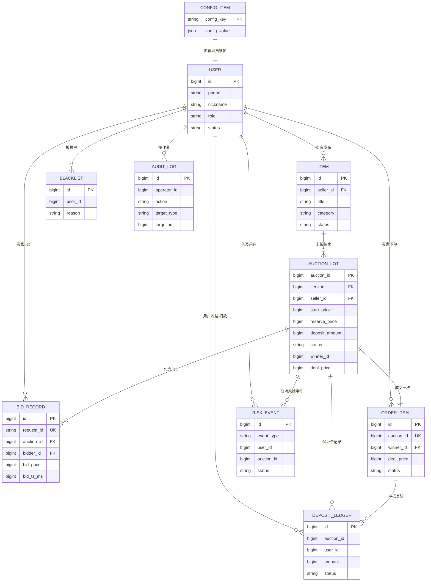

# 实时竞拍大师 · 数据库设计文档（3 周 MVP）

> 适用范围：3 周 MVP 直播竞拍系统的 Go 后端持久化设计。本设计文档与 `ddl.sql` 配套使用，并对齐 `直播竞拍系统技术设计方案.md` 第 10.2 节的口径。

---

## 1. 概览

| 项 | 选型 | 备注 |
| --- | --- | --- |
| 关系数据库 | MySQL **8.0** | 业务持久化主存储 |
| 字符集 / 排序规则 | `utf8mb4` / `utf8mb4_0900_ai_ci` | 全库统一 |
| 引擎 | InnoDB | 行级锁、事务、外键能力（MVP 不强制 FK） |
| 时间精度 | `DATETIME(3)`（毫秒） | 所有 `created_at` / `updated_at` / `start_time` / `end_time` 等字段 |
| 时区 | `+08:00`（业务侧），存储侧建议 UTC，应用层统一 | DDL 头部 `SET time_zone='+08:00'` 仅用于 DEMO 演示 |
| 缓存 / 运行态 | Redis **7** 单实例 | 拍卖运行态、幂等键、频控 |
| 金额单位 | **分（BIGINT）** | 全部金额字段统一以「分」为单位的整数存储，避免浮点误差 |
| 主键 | 业务表统一 `BIGINT UNSIGNED AUTO_INCREMENT`（`auction_lot` 沿用 `auction_id BIGINT` 与方案口径一致） | snake_case |
| 命名 | snake_case；表名单数（`user`, `item`, `auction_lot`） | |
| 外键 | **MVP 不启用**外键约束（避免锁与迁移问题），关联关系在字段 `COMMENT` 中标注 | |

---

## 2. ER 关系图



---

## 3. 核心表清单

| # | 表名 | 业务说明 |
| --- | --- | --- |
| 1 | `user` | 用户基础信息（买家 / 商家 / 管理员） |
| 2 | `item` | 商品信息（商家维度） |
| 3 | `auction_lot` | 拍品 / 拍卖实例（含规则快照、状态机） |
| 4 | `bid_record` | 出价事实表（含幂等保障） |
| 5 | `order_deal` | 成交订单 |
| 6 | `deposit_ledger` | 保证金账本（模拟冻结 / 扣转） |
| 7 | `audit_log` | 后台审计日志 |
| 8 | `blacklist` | 黑名单 |
| 9 | `risk_event` | 风险事件（频控 / 异常出价 / 围标嫌疑等） |
| 10 | `config_item` | 平台级 KV 配置（增价规则模板、保证金策略默认值等） |

---

## 4. 字段说明

### 4.1 `user` 用户

| 字段 | 类型 | 约束 | 说明 |
| --- | --- | --- | --- |
| `id` | BIGINT UNSIGNED | PK, AUTO_INCREMENT | 用户 ID |
| `phone` | VARCHAR(32) | UNIQUE, NOT NULL | 手机号（MVP 阶段为登录主键） |
| `nickname` | VARCHAR(64) | NOT NULL | 昵称 |
| `avatar_url` | VARCHAR(512) | NULL | 头像 |
| `role` | VARCHAR(16) | NOT NULL DEFAULT 'user' | 角色：`user` / `merchant` / `admin` |
| `status` | VARCHAR(16) | NOT NULL DEFAULT 'active' | `active` / `frozen` / `deleted` |
| `last_login_at` | DATETIME(3) | NULL | 最近登录时间 |
| `created_at` | DATETIME(3) | NOT NULL DEFAULT CURRENT_TIMESTAMP(3) | |
| `updated_at` | DATETIME(3) | NOT NULL DEFAULT CURRENT_TIMESTAMP(3) ON UPDATE | |

### 4.2 `item` 商品

| 字段 | 类型 | 约束 | 说明 |
| --- | --- | --- | --- |
| `id` | BIGINT UNSIGNED | PK, AUTO_INCREMENT | 商品 ID |
| `seller_id` | BIGINT UNSIGNED | NOT NULL | 卖家 → `user.id` |
| `title` | VARCHAR(128) | NOT NULL | 标题 |
| `category` | VARCHAR(64) | NOT NULL | 分类 |
| `brand` | VARCHAR(64) | NULL | 品牌 |
| `condition_grade` | VARCHAR(16) | NOT NULL DEFAULT 'NEW' | 成色：`NEW` / `LIKE_NEW` / `GOOD` / `FAIR` |
| `images` | JSON | NOT NULL | 图片 URL 数组 |
| `description` | TEXT | NULL | 描述 |
| `status` | VARCHAR(16) | NOT NULL DEFAULT 'DRAFT' | `DRAFT` / `READY` / `LISTED` / `OFFLINE` |
| `created_at` / `updated_at` | DATETIME(3) | | 同上 |

### 4.3 `auction_lot` 拍品

> 与《直播竞拍系统技术设计方案.md》第 10.2 节对齐，并补充 `winner_id`、`deal_price`、`closed_at`、`closed_by`。

| 字段 | 类型 | 约束 | 说明 |
| --- | --- | --- | --- |
| `auction_id` | BIGINT | PK | 拍品 ID（与方案口径一致，业务侧分配） |
| `item_id` | BIGINT | NOT NULL | 关联商品 → `item.id` |
| `seller_id` | BIGINT | NOT NULL | 卖家 → `user.id` |
| `auction_type` | VARCHAR(16) | NOT NULL DEFAULT 'ENGLISH' | 仅支持 `ENGLISH`（英式拍卖） |
| `start_price` | BIGINT | NOT NULL | 起拍价（分），**允许 0**（0 元起拍） |
| `reserve_price` | BIGINT | NOT NULL DEFAULT 0 | 保留价（分），0 表示无保留价 |
| `increment_rule` | JSON | NOT NULL | 增价规则（阶梯加价等） |
| `anti_sniping_sec` | INT | NOT NULL DEFAULT 15 | 反狙击触发窗口（秒） |
| `anti_extend_sec` | INT | NOT NULL DEFAULT 30 | 反狙击延长时长（秒） |
| `deposit_amount` | BIGINT | NOT NULL | 保证金金额（分） |
| `status` | VARCHAR(32) | NOT NULL | 见 7.1 状态机 |
| `rule_snapshot` | JSON | NOT NULL | 规则快照（不可变，参考第 10.3 节） |
| `start_time` | DATETIME(3) | NOT NULL | 开拍时间 |
| `end_time` | DATETIME(3) | NOT NULL | 计划结束时间（可被反狙击延长） |
| `winner_id` | BIGINT UNSIGNED | NULL | 中拍用户 → `user.id` |
| `deal_price` | BIGINT | NULL | 成交价（分） |
| `closed_at` | DATETIME(3) | NULL | 实际落锤时间 |
| `closed_by` | VARCHAR(32) | NULL | 落锤来源：`AUTO` / `ADMIN` / `RISK_TERMINATE` |
| `created_at` / `updated_at` | DATETIME(3) | | |

### 4.4 `bid_record` 出价记录

| 字段 | 类型 | 约束 | 说明 |
| --- | --- | --- | --- |
| `id` | BIGINT UNSIGNED | PK, AUTO_INCREMENT | |
| `request_id` | VARCHAR(64) | UNIQUE NOT NULL | 客户端幂等键，落库后保证不重复扣减 |
| `auction_id` | BIGINT | NOT NULL | → `auction_lot.auction_id` |
| `bidder_id` | BIGINT UNSIGNED | NOT NULL | → `user.id` |
| `bid_price` | BIGINT | NOT NULL | 本次出价（分） |
| `bid_ts_ms` | BIGINT | NOT NULL | 服务端受理时间戳（毫秒） |
| `source` | VARCHAR(32) | NOT NULL DEFAULT 'live_ws' | 来源：`live_ws` / `http` / `admin_proxy` |
| `risk_result` | VARCHAR(32) | NOT NULL DEFAULT 'ALLOW' | `ALLOW` / `REJECT` / `REVIEW` |
| `reject_reason` | VARCHAR(64) | NULL | 拒绝原因（如 `BELOW_MIN_INC`、`BLACKLIST`） |
| `created_at` | DATETIME(3) | NOT NULL DEFAULT CURRENT_TIMESTAMP(3) | |

### 4.5 `order_deal` 成交订单

| 字段 | 类型 | 约束 | 说明 |
| --- | --- | --- | --- |
| `id` | BIGINT UNSIGNED | PK, AUTO_INCREMENT | |
| `auction_id` | BIGINT | UNIQUE NOT NULL | 一拍一单，防重复成交 |
| `winner_id` | BIGINT UNSIGNED | NOT NULL | → `user.id` |
| `seller_id` | BIGINT UNSIGNED | NOT NULL | → `user.id` |
| `deal_price` | BIGINT | NOT NULL | 成交价（分） |
| `deposit_amount` | BIGINT | NOT NULL DEFAULT 0 | 已冻结保证金金额（分） |
| `status` | VARCHAR(16) | NOT NULL DEFAULT 'CREATED' | 见 7.2 |
| `pay_status` | VARCHAR(16) | NOT NULL DEFAULT 'UNPAID' | `UNPAID` / `PAID` / `REFUNDED` |
| `pay_deadline` | DATETIME(3) | NULL | 支付截止时间 |
| `paid_at` | DATETIME(3) | NULL | 支付完成时间 |
| `closed_at` | DATETIME(3) | NULL | 订单关闭时间 |
| `created_at` / `updated_at` | DATETIME(3) | | |

### 4.6 `deposit_ledger` 保证金账本

| 字段 | 类型 | 约束 | 说明 |
| --- | --- | --- | --- |
| `id` | BIGINT UNSIGNED | PK, AUTO_INCREMENT | |
| `auction_id` | BIGINT | NOT NULL | → `auction_lot.auction_id` |
| `user_id` | BIGINT UNSIGNED | NOT NULL | → `user.id` |
| `amount` | BIGINT | NOT NULL | 金额（分） |
| `status` | VARCHAR(16) | NOT NULL | `PENDING` / `READY` / `CAPTURED` / `RELEASED` / `FAILED` |
| `related_order_id` | BIGINT UNSIGNED | NULL | → `order_deal.id`（CAPTURED 时绑定） |
| `remark` | VARCHAR(256) | NULL | 备注 |
| `created_at` / `updated_at` | DATETIME(3) | | |

唯一性：`(auction_id, user_id)` 同一用户在同一拍场只允许一条有效保证金记录。

### 4.7 `audit_log` 审计日志

| 字段 | 类型 | 约束 | 说明 |
| --- | --- | --- | --- |
| `id` | BIGINT UNSIGNED | PK, AUTO_INCREMENT | |
| `operator_id` | BIGINT UNSIGNED | NOT NULL | → `user.id` |
| `operator_role` | VARCHAR(16) | NOT NULL | `user` / `merchant` / `admin` |
| `action` | VARCHAR(64) | NOT NULL | 动作枚举（如 `AUCTION_AUDIT_PASS`、`HAMMER`、`BLACKLIST_ADD`） |
| `target_type` | VARCHAR(32) | NOT NULL | 目标类型：`AUCTION` / `ORDER` / `USER` / `ITEM` |
| `target_id` | VARCHAR(64) | NOT NULL | 目标 ID（字符串以兼容业务态主键） |
| `payload` | JSON | NULL | 请求 / 业务上下文 |
| `ip` | VARCHAR(64) | NULL | 操作 IP |
| `ua` | VARCHAR(256) | NULL | User-Agent |
| `created_at` | DATETIME(3) | NOT NULL DEFAULT CURRENT_TIMESTAMP(3) | |

### 4.8 `blacklist` 黑名单

| 字段 | 类型 | 约束 | 说明 |
| --- | --- | --- | --- |
| `id` | BIGINT UNSIGNED | PK, AUTO_INCREMENT | |
| `user_id` | BIGINT UNSIGNED | NOT NULL | → `user.id` |
| `reason` | VARCHAR(256) | NOT NULL | 拉黑原因 |
| `created_by` | BIGINT UNSIGNED | NOT NULL | 操作者 → `user.id` |
| `created_at` | DATETIME(3) | NOT NULL DEFAULT CURRENT_TIMESTAMP(3) | |
| `expires_at` | DATETIME(3) | NULL | 过期时间，NULL 表示永久 |

### 4.9 `risk_event` 风险事件

| 字段 | 类型 | 约束 | 说明 |
| --- | --- | --- | --- |
| `id` | BIGINT UNSIGNED | PK, AUTO_INCREMENT | |
| `event_type` | VARCHAR(32) | NOT NULL | `BID_FREQ` / `SHILL_BIDDING` / `ABUSE_RETRY` … |
| `user_id` | BIGINT UNSIGNED | NULL | 涉及用户 |
| `auction_id` | BIGINT | NULL | 涉及拍场 |
| `severity` | VARCHAR(8) | NOT NULL DEFAULT 'LOW' | `LOW` / `MID` / `HIGH` |
| `payload` | JSON | NULL | 命中详情 |
| `status` | VARCHAR(16) | NOT NULL DEFAULT 'PENDING' | `PENDING` / `REVIEWED` / `IGNORED` |
| `reviewed_by` | BIGINT UNSIGNED | NULL | 复核人 |
| `reviewed_at` | DATETIME(3) | NULL | 复核时间 |
| `created_at` | DATETIME(3) | NOT NULL DEFAULT CURRENT_TIMESTAMP(3) | |

### 4.10 `config_item` 平台级配置

| 字段 | 类型 | 约束 | 说明 |
| --- | --- | --- | --- |
| `config_key` | VARCHAR(64) | PK | 配置键，如 `default.deposit_ratio` |
| `config_value` | JSON | NOT NULL | 配置值（对象 / 数组 / 标量都用 JSON 包装） |
| `description` | VARCHAR(256) | NULL | 中文说明 |
| `updated_by` | BIGINT UNSIGNED | NULL | 最近修改者 |
| `updated_at` | DATETIME(3) | NOT NULL DEFAULT CURRENT_TIMESTAMP(3) ON UPDATE | |

---

## 5. 索引设计

| 表 | 索引 | 类型 | 设计理由 |
| --- | --- | --- | --- |
| `user` | `PRIMARY(id)` | 主键 | |
| `user` | `uk_phone(phone)` | 唯一 | 手机号唯一登录 |
| `user` | `idx_role_status(role, status)` | 二级 | 后台按角色 / 状态分页 |
| `item` | `PRIMARY(id)` | 主键 | |
| `item` | `idx_seller_status(seller_id, status)` | 组合 | 商家维度商品列表 |
| `item` | `idx_category(category)` | 二级 | 分类筛选 |
| `auction_lot` | `PRIMARY(auction_id)` | 主键 | |
| `auction_lot` | `idx_item_id(item_id)` | 二级 | 商品反查 |
| `auction_lot` | `idx_seller_id(seller_id)` | 二级 | 商家拍场列表 |
| `auction_lot` | `idx_status_end_time(status, end_time)` | 组合 | **核心**：调度器扫描 RUNNING / EXTENDED 即将结束的拍场 |
| `auction_lot` | `idx_winner_id(winner_id)` | 二级 | 中拍记录查询 |
| `bid_record` | `PRIMARY(id)` | 主键 | |
| `bid_record` | `uk_request_id(request_id)` | 唯一 | **幂等保障**，重复出价直接 `ON DUPLICATE` / 报错 |
| `bid_record` | `idx_auction_bid_ts(auction_id, bid_ts_ms)` | 组合 | 拍场内按时间扫描重放 |
| `bid_record` | `idx_bidder_id(bidder_id)` | 二级 | 用户出价历史 |
| `order_deal` | `PRIMARY(id)` | 主键 | |
| `order_deal` | `uk_auction_id(auction_id)` | 唯一 | **一拍一单**，防止重复成交 |
| `order_deal` | `idx_winner_id(winner_id)` | 二级 | 我的待付订单 |
| `order_deal` | `idx_status_pay_deadline(status, pay_deadline)` | 组合 | 超时未支付扫描 |
| `deposit_ledger` | `PRIMARY(id)` | 主键 | |
| `deposit_ledger` | `uk_auction_user(auction_id, user_id)` | 唯一 | 同用户在同拍场只一条有效记录 |
| `deposit_ledger` | `idx_user_status(user_id, status)` | 组合 | 我的保证金 |
| `audit_log` | `PRIMARY(id)` | 主键 | |
| `audit_log` | `idx_operator_created(operator_id, created_at)` | 组合 | 按操作者审计 |
| `audit_log` | `idx_target(target_type, target_id)` | 组合 | 按目标对象审计 |
| `blacklist` | `PRIMARY(id)` | 主键 | |
| `blacklist` | `uk_user_id(user_id)` | 唯一 | 一人一条；过期由 `expires_at` 控制 |
| `risk_event` | `PRIMARY(id)` | 主键 | |
| `risk_event` | `idx_status_created(status, created_at)` | 组合 | 待复核队列 |
| `risk_event` | `idx_auction_user(auction_id, user_id)` | 组合 | 拍场维度风险查看 |

---

## 6. Redis Key 设计

> Redis 7 单实例。所有运行态 Key 在拍卖结束后保留 30 分钟（`EXPIRE 1800`），用于断线重连恢复。

| Key 模式 | 类型 | TTL | 说明 |
| --- | --- | --- | --- |
| `auction:{id}:state` | Hash | 拍卖结束 +30min | 字段：`current_price` / `leader_bidder_id` / `status` / `start_ts_ms` / `end_ts_ms` / `last_bid_ts_ms` / `extend_count` |
| `auction:{id}:bids` | ZSet | 拍卖结束 +30min | 排行榜：`score = price * 1e7 - ts_ms`（高价优先；同价时间早的优先） |
| `auction:{id}:user_bids` | Hash | 拍卖结束 +30min | `field=user_id`，`value=JSON({best_price, ts_ms, request_id})`，每个用户最高价 |
| `auction:{id}:idem:{request_id}` | String | 300s | 出价幂等键：值为已落库的 `bid_record.id`，相同 `request_id` 直接命中返回 |
| `auction:{id}:lock:close` | String | 10s | 落锤分布式锁（SET NX PX 10000），保障 hammer 流程单实例执行 |
| `auction:{id}:stream` | Stream | 拍卖结束 +30min | 事件流（出价 / 价格更新 / 延时 / 落锤），WS 网关订阅推送 |
| `online:auction:{id}` | Set / Hash | 实时维护 | 在线用户统计（可选）；用于直播间在线数 |
| `risk:freq:bid:{user_id}:{auction_id}` | String + INCR | 1s / 10s | 频控：1 秒窗口 + 10 秒窗口双层；超阈值生成 `risk_event` |
| `risk:blacklist:user` | Set | 永久（启动时回灌） | 黑名单缓存，出价前 SISMEMBER 查询 |
| `config:item:{key}` | String(JSON) | 60s | `config_item` 缓存（可选） |

---

## 7. 状态机映射

### 7.1 拍品 `auction_lot.status`

```
DRAFT          -- 商家草稿
  ↓ 提交审核
PENDING_AUDIT  -- 等待运营审核
  ↓ 审核通过
READY          -- 等待开拍
  ↓ 系统调度（开拍前 N 秒）
WARMING_UP     -- 暖场中（直播间已开放，未到开拍时间）
  ↓ 到达 start_time
RUNNING        -- 拍卖进行中
  ↓ 末段被新出价触发反狙击
EXTENDED       -- 已延时（可多次，状态保留 RUNNING 下的子状态语义；简化版 MVP 可与 RUNNING 同语义但用 EXTENDED 标识便于审计）
  ↓ 计划 end_time 到达且无新出价
HAMMER_PENDING -- 落锤中（短暂中间态，受 lock:close 保护）
  ↓ 有最高价 + ≥ reserve_price
CLOSED_WON     -- 成交
  ↓ 无人出价 / 流拍 / 未达 reserve
CLOSED_FAILED  -- 流拍
  ↓ 订单 + 保证金 + 资金清算完成
SETTLED        -- 结算完毕（终态）
```

### 7.2 订单 `order_deal.status`

```
CREATED  ──支付成功──▶ PAID
   │
   ├──支付超时──▶ TIMEOUT
   └──手动取消──▶ CANCELLED
```

`pay_status` 与 `status` 解耦，支持 `PAID` 后退款产生 `REFUNDED`，但订单 `status` 仍可能保持 `PAID` 或被运营改 `CANCELLED`。

### 7.3 保证金 `deposit_ledger.status`

```
PENDING ──预冻结成功──▶ READY
   │                       │
   │                       ├──成交扣转──▶ CAPTURED
   │                       └──未中拍释放──▶ RELEASED
   └──预冻结失败──▶ FAILED
```

---

## 8. 数据保留与清理策略

- **`bid_record`**：长期保留，作为出价事实表与审计依据，不做归档（MVP 阶段数据量级有限）。
- **`audit_log`**：长期保留，支撑后台合规追溯。
- **`risk_event`**：长期保留，作为风控样本积累。
- **`order_deal` / `deposit_ledger`**：长期保留。
- **Redis 运行态**（`auction:{id}:*`）：拍卖进入 `SETTLED` 后保留 30 分钟，用于断线重连恢复，超过后由后台 worker 主动 `DEL` 或依赖 `EXPIRE`。
- **幂等键 `auction:{id}:idem:{request_id}`**：固定 300s TTL，仅覆盖客户端重试窗口。
- **黑名单缓存 `risk:blacklist:user`**：服务启动 / 黑名单变更时回灌；不设 TTL。

---

## 9. 备注

- **MVP 不引入分库分表 / 分区表**：3 周交付的体量预估 < 1000 万行 `bid_record`，单库单表 + 合理索引足够。
- **金额统一以「分」为整数**：所有 `*_price` / `amount` / `deposit_*` 字段 BIGINT，单位分；前端展示统一在表现层除以 100。
- **JSON 列**（`increment_rule` / `rule_snapshot` / `images` / `payload` / `config_value`）便于后续规则演进，无需 DDL 变更。
- **后续 T1.2** 任务会通过 `golang-migrate` 落地迁移文件；本次只交付完整的初始 DDL（`ddl.sql`）作为基线。
